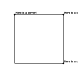
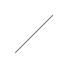
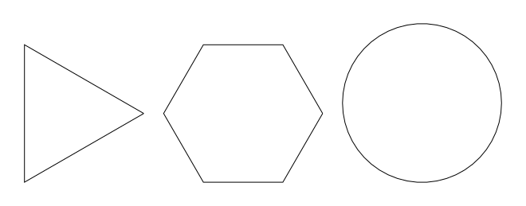
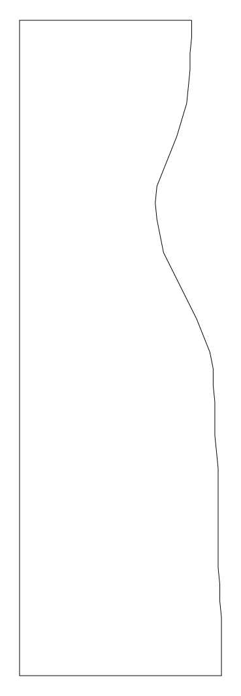
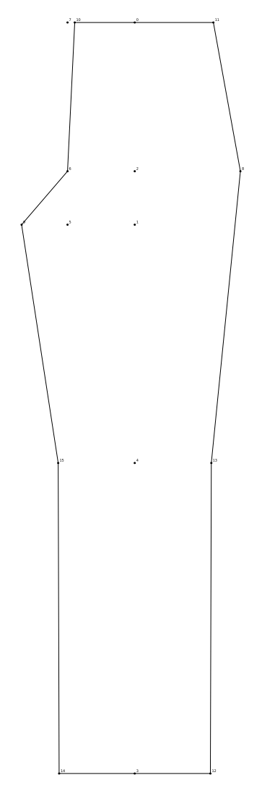

# Pattern cutting

This is a python library for pattern cutting.

This readme can be converted into a Jupyter notebook and ran using the
`run.sh` script.

## `vec2` class

A class for 2d cartesian coordinates. Its used for point coordinates and
also for 2d vectors


```python
from geometry.vec2 import vec2

origin = vec2(0,0)
origin.label = "Origin"

```

You can use the render function to generate an SVG representation of the
geometry


```python
from render import render
render(origin)
```


    

    


## Shape

A `Shape` object is defined by multiple points which are joined by
line segemnts to create a complicated line or shape.


```python
from geometry.Shape import Shape

square = Shape([vec2(0, 0), vec2(100, 0), vec2(100, 100), vec2(0, 100), vec2(0, 0)])

render(square)
```


    

    


You can draw measurement markers along a polyline:


```python
render(
  square, 
  *square.evenlySpacedMeasurements()
)
```


    

    


Or automatically detect corners:


```python
corners = square.corners()
for corner in corners:
  corner.label = "Here is a corner!"

render(
  square,
  *corners
)
```


    

    


You can slice out a certain portion of a line:


```python

render(
  square.slice(25, 175)
)
```


    

    


The circle class can be used to generate regular polygons with so many
sides they look like a circle:


```python
from geometry.Circle import Circle

circle = Circle(vec2(0, 0), 100)
triangle = circle.polyline(3)
hexagon = circle.polyline(6)
almostCircle = circle.polyline(50)

from layout import layout
render(*layout([triangle, hexagon, almostCircle]))
```


    

    


We can put this together to get good approximations of measurements
along a curve:


```python
arc = circle.polyline(100).slice(0, 150)
render(
  arc,
  *arc.evenlySpacedMeasurements()
  )
```


    

    


## Finding the closest point on a polyline

We can find the closest point on a polyline to any given coordinate:


```python
shape = arc
X = vec2(90, 100)
X.label = "X"
Y = shape.closestPoint(X)
Y.label = "Y"
render(
  shape,
  X,
  Y
)
```


    

    


You can use closest points in other methods too, such as `slice`


```python
shape = arc
P = vec2(90, 100)
P.label = "P"
Q = vec2(100, 0)
Q.label = "Q"
sliced = shape.slice(P, Q).moveRight(150)
sliced.label = "sliced"
render(P, Q, shape, sliced, *sliced.points)
```


    

    


## Die Lemma dress block

One of the main applications of this library is to create outfits for
East London drag queen [Die
Lemma](https://www.instagram.com/die.lemma/).

A dress block for Die was created and digitised into this library:


```python
from DieLemmaDressBlock import DieLemmaDressBlock

render(DieLemmaDressBlock)
```


    

    


Drawing parallels to a complex polyline:


```python
render(
  DieLemmaDressBlock,
  DieLemmaDressBlock.parallel(50)
)
```


    

    


or drawing inside the shape instead of outside,


```python
render(
  DieLemmaDressBlock,
  DieLemmaDressBlock.parallel(-25)
)
```


    

    


## Winnifred Owen pattern blocks

### Trouser block


```python
from TheClassicTailoredTrouserBlock import TheClassicTailoredTrouserBlock

render(TheClassicTailoredTrouserBlock())
```


    

    


