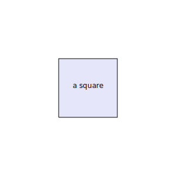
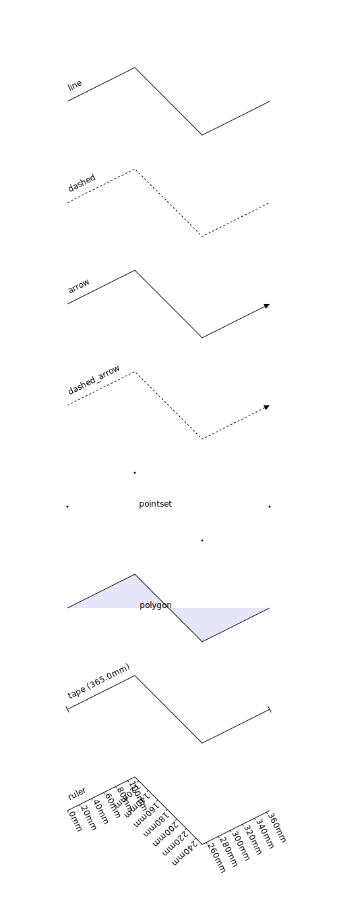
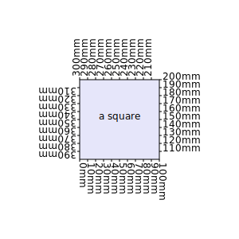
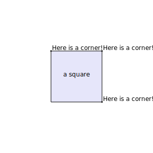
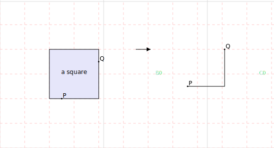
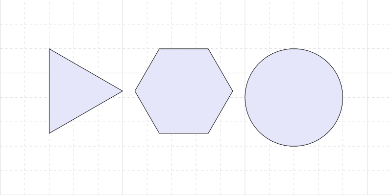
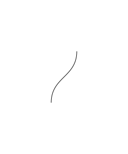
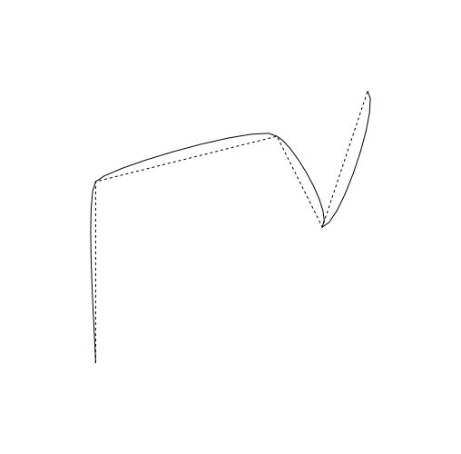
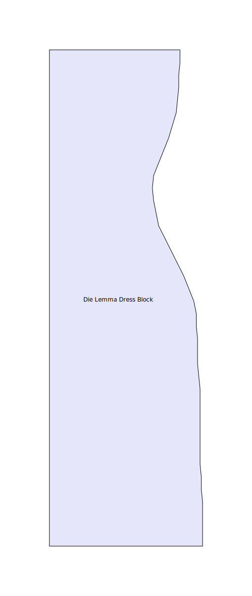

This is a python library for pattern cutting.

## `vec2` class

A class for 2d cartesian coordinates. Its used for point coordinates and
also for 2d vectors


```python
from geometry.vec2 import vec2

origin = vec2(0,0)
origin.label = "Origin"

```

You can use the render function to generate an SVG representation of the
geometry


```python
from render import render
render(origin)
```


    

    


## Shape

A `Shape` object is defined by multiple points which are joined by line
segemnts to create a complicated line or shape.


```python
from geometry.Shape import Shape

square = Shape([
  vec2(0, 0), 
  vec2(100, 0), 
  vec2(100, 100), 
  vec2(0, 100), 
  vec2(0, 0)]
).with_label("a square").with_style("polygon")

render(square)
```

    10.0


    

    


Using the `style` property, a polyline can be rendered as many different
kinds of shapes.


```python
from layout import topToBottom

shape = Shape([vec2(0, 0), vec2(100, 50), vec2(200, -50), vec2(300, 0)])

render(
  *topToBottom(
    shape.with_style("line").with_label("line"),
    shape.with_style("dashed").with_label("dashed"),
    shape.with_style("arrow").with_label("arrow"),
    shape.with_style("dashed_arrow").with_label("dashed_arrow"),
    shape.with_style("pointset").with_label("pointset"),
    shape.with_style("polygon").with_label("polygon"),
    shape.with_style("tape").with_label("tape"),
    shape.with_style("ruler").with_label("ruler")
  )
)
```

    8.0
    8.0


    

    


You can draw measurement markers along a polyline:


```python
render(
  square, 
  *square.evenlySpacedMeasurements()
)
```

    10.0


    

    


Or automatically detect corners:


```python
corners = square.corners()

render(
  square,
  *[corner.with_label("Here is a corner!") for corner in corners]
)
```

    10.0


    

    


You can slice out a certain portion of a line:


```python
from layout import process
from geometry.Group import Group

P = square.at(25).point.with_label("P")
Q = square.at(175).point.with_label("Q")

render(
  *process(
    Group(
      square,
      P,
      Q,
    ),

    Group(
      square.slice(25, 175),
      P, Q
    )
  )
)
```

    None 100
    None 30
    None 75.0
    10.0


    

    


The circle class can be used to generate regular polygons with so many
sides they look like a circle:


```python
from geometry.Circle import Circle

circle = Circle(vec2(0, 0), 100)
triangle = circle.polyline(3)
hexagon = circle.polyline(6)
almostCircle = circle.polyline(50)

from layout import sideBySide
render(*sideBySide(triangle, hexagon, almostCircle))
```

    None 150.00000000000006
    None 200.0
    None 200.0


    

    


We can put this together to get good approximations of measurements
along a curve:


```python
arc = circle.polyline(100).slice(0, 150)
render(
  arc,
  *arc.evenlySpacedMeasurements()
  )
```


    

    


## BezierCurves


```python
from geometry.Shape import dashed
from geometry.bezier import BezierCurve
p0 = vec2(0,0).with_label("p0")
p1 = vec2(0, 50).with_label("p1")
p2 = vec2(50, 50).with_label("p2")
p3 = vec2(50, 100).with_label("p3")


mycurve = BezierCurve(p0, p1, p2, p3)

render(
  *mycurve.points(20),
  p0,
  p1, 
  dashed(p0, p1),
  p2,
  p3,
  dashed(p2,p3)
  )
```


    

    


```python
render(
  mycurve.shape(50),
  p0,
  p1, 
  dashed(p0, p1),
  p2,
  p3,
  dashed(p2,p3)
)
```


    

    


Interpolating a `Shape`


```python
myshape = Shape([vec2(0,0), vec2(0, 200), vec2(200,250), vec2(250, 150), vec2(300 , 300)])
render(
  myshape.with_style("dashed"),
  myshape.interpolate()
)
```


    

    


## Finding the closest point on a polyline

We can find the closest point on a polyline to any given coordinate:


```python
from geometry.Shape import dashed_arrow
shape = arc
X = vec2(90, 100)
Y = shape.closestPoint(X)

render(
  shape,
  X.with_label("X"),
  Y.with_label("Y"),
  dashed_arrow(X, Y)
)
```


    

    


You can use closest points in other methods too, such as `slice`


```python
shape = arc
P = vec2(90, 100).with_label("P")
Q = vec2(100, 0).with_label("Q")
sliced = shape.slice(P, Q)
render(
  *process(
    Group(
      P,
      Q,
      dashed_arrow(P, shape.at(P).point),
      shape.with_label("Original"), 
    ),
    Group(
      sliced.with_label("sliced"), 
      *sliced.points, P, Q
    )
  )
  )
```

    None 92.95272905355262
    None 30
    None 32.867184771461226


    

    


## Die Lemma dress block

One of the main applications of this library is to create outfits for
East London drag queen [Die
Lemma](https://www.instagram.com/die.lemma/).

A dress block for Die was created and digitised into this library:


```python
from DieLemmaDressBlock import DieLemmaDressBlock

render(DieLemmaDressBlock)
```

    88.0


    

    


Drawing parallels to a complex polyline:


```python
render(
  DieLemmaDressBlock,
  DieLemmaDressBlock.parallel(50),
  *[dashed_arrow(P, Q) for P,Q in zip(DieLemmaDressBlock.points, DieLemmaDressBlock.parallel(50).points)],
  *DieLemmaDressBlock.points
)
```

    88.0


    

    


or drawing inside the shape instead of outside,


```python
render(
  DieLemmaDressBlock,
  DieLemmaDressBlock.parallel(-25),
  *[dashed_arrow(P, Q) for P,Q in zip(DieLemmaDressBlock.points, DieLemmaDressBlock.parallel(-25).points)],
  *DieLemmaDressBlock.points
)
```

    88.0


    

    


## Winnifred Owen pattern blocks

### Trouser block


```python
from TheClassicTailoredTrouserBlock import TheClassicTailoredTrouserBlock

render(TheClassicTailoredTrouserBlock())
```

    26.0


    

    


