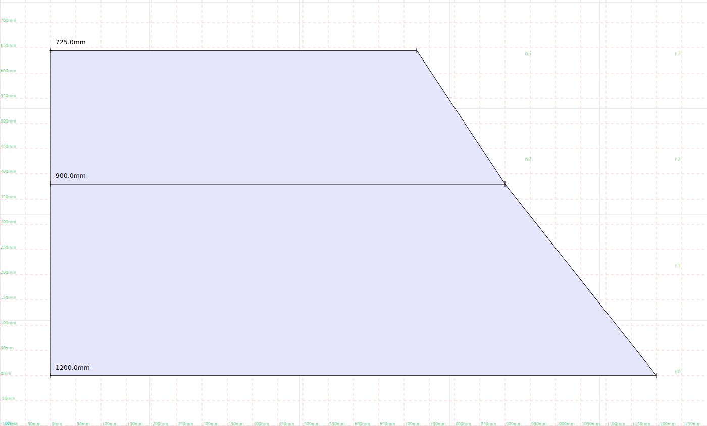

This is a python library for pattern cutting.

## `Vector` class

A class for 2d cartesian coordinates. Its used for point coordinates and
also for 2d vectors


```python
from src.geometry.Vector import Vector

origin = Vector(0,0)
origin.label = "Origin"

```

You can use the render function to generate an SVG representation of the
geometry


```python
from src.render import render
render(origin)
```


    

    


## Shape

A `Shape` object is defined by multiple points which are joined by line
segemnts to create a complicated line or shape.


```python
from src.geometry.Shape import Shape

square = Shape([
  Vector(0, 0),
  Vector(100, 0),
  Vector(100, 100),
  Vector(0, 100),
  Vector(0, 0)]
).with_label("a square").with_style("polygon")

render(square)
```


    

    


Using the `style` property, a polyline can be rendered as many different
kinds of shapes.


```python
from layout import topToBottom

shape = Shape([Vector(0, 0), Vector(100, 50), Vector(200, -50), Vector(300, 0)])

render(
  *topToBottom(
    shape.with_style("line").with_label("line"),
    shape.with_style("dashed").with_label("dashed"),
    shape.with_style("arrow").with_label("arrow"),
    shape.with_style("dashed_arrow").with_label("dashed_arrow"),
    shape.with_style("pointset").with_label("pointset"),
    shape.with_style("polygon").with_label("polygon"),
    shape.with_style("tape").with_label("tape"),
    shape.with_style("ruler").with_label("ruler")
  )
)
```


    

    


You can draw measurement markers along a polyline:


```python
render(
  square,
  *square.evenlySpacedMeasurements()
)
```


    

    


Or automatically detect corners:


```python
corners = square.corners()

render(
  square,
  *[corner.with_label("Here is a corner!") for corner in corners]
)
```


    

    


You can slice out a certain portion of a line:


```python
from layout import process
from src.geometry.Group import Group

P = square.at(25).point.with_label("P")
Q = square.at(175).point.with_label("Q")

render(
  *process(
    Group(
      square,
      P,
      Q,
    ),

    Group(
      square.slice(25, 175),
      P, Q
    )
  )
)
```


    

    


The circle class can be used to generate regular polygons with so many
sides they look like a circle:


```python
from src.geometry.Circle import Circle

circle = Circle(Vector(0, 0), 100)
triangle = circle.polyline(3)
hexagon = circle.polyline(6)
almostCircle = circle.polyline(50)

from layout import sideBySide
render(*sideBySide(triangle, hexagon, almostCircle))
```


    

    


We can put this together to get good approximations of measurements
along a curve:


```python
arc = circle.polyline(100).slice(0, 150)
render(
  arc,
  *arc.evenlySpacedMeasurements()
  )
```


    

    


## Bezier Curves


```python
from src.geometry.Shape import dashed
from src.geometry.bezier import BezierCurve
p0 = Vector(0,0).with_label("p0")
p1 = Vector(0, 50).with_label("p1")
p2 = Vector(50, 50).with_label("p2")
p3 = Vector(50, 100).with_label("p3")


mycurve = BezierCurve(p0, p1, p2, p3)

render(
  mycurve.demo()
  )
```


    

    


### Interpolating a `Shape` with Bezier Curves


```python
myshape = Shape([Vector(0,0), Vector(0, 200), Vector(200,250), Vector(250, 150), Vector(300 , 300)])

render(
  myshape.with_style("dashed"),
  myshape.interpolate(),
)
```


    

    


This makes a lot of points apear, so it might be a good idea to resample
the curve at lower resolution:


```python
interpolated = myshape.interpolate()
downsampled = interpolated.resample(25)
render(
  *topToBottom(
    interpolated.with_style("pointset"),
    downsampled.with_style("pointset").with_label("Re-sampled")
  )
)
```


    

    


Demonstrating different curve speeds


```python
gen = [myshape]
for i in range(0, 20):
  next = myshape.interpolate((i+1) / 4)
  gen.append(next)

render(*gen)
```


    

    


## Finding the closest point on a polyline

We can find the closest point on a polyline to any given coordinate:


```python
from src.geometry.Shape import dashed_arrow
shape = arc
X = Vector(90, 100)
Y = shape.closestPoint(X)

render(
  shape,
  X.with_label("X"),
  Y.with_label("Y"),
  dashed_arrow(X, Y)
)
```


    

    


You can use closest points in other methods too, such as `slice`


```python
shape = arc
P = Vector(90, 100).with_label("P")
Q = Vector(100, 0).with_label("Q")
sliced = shape.slice(P, Q)
render(
  *process(
    Group(
      P,
      Q,
      dashed_arrow(P, shape.at(P).point),
      shape.with_label("Original"),
    ),
    Group(
      sliced.with_label("sliced"),
      *sliced.points, P, Q
    )
  )
  )
```


    

    


## Replacing a section of a shape

Here are two shapes


```python
a = Shape([Vector(-100, 200), Vector(200, -100)])
b = arc

render(a.with_label("a simple shape"), b.with_label("replacement"))
```


    

    


We can replace a region of one with the other


```python
render(a.replace(b))
```


    

    


## Tweening between shapes

Tweening lets you morph one shape smoothly into another:


```python
from src.geometry.tween import tween, tween_demo

a = Shape([Vector(-100, 200), Vector(200, -100)])
b = arc

render(tween_demo(a, b))
```


    

    


A circle becoming a square,


```python
render(tween_demo(square, circle.polyline(100)))
```


    

    


## Turtle/Spirograph curves


```python
import math
from src.spirograph import spiro
angle_over_length = lambda x : math.radians(x*.1)
spiral = spiro(angle_over_length, 10000)
render(spiral)
```


    

    


## Adding darts


```python
shape = Shape([Vector(0,0), Vector(100, 0)])
shape.addDart(Vector(50, 0), 50, 20)
render(shape)
```


    

    


```python
shape = Shape([Vector(0,0), Vector(0, 100)])
shape.addDart(Vector(0, 50), 50, 20)
render(shape)
```


    

    


## Collision detection

Collision detection is powered by the
[qwertyquerty/collision](https://github.com/qwertyquerty/collision/blob/master/examples/concaves.py)
library.


```python
from src.geometry.Shape import rectangle
example_shape = rectangle(0, 0, 100, 100)
example_points = [Vector(50, 50), Vector(150, 50)]

for p in example_points:
  if example_shape.point_is_inside(p):
    p.label = "Collision!"
  else:
    p.label = "No collision!"

render(example_shape, *example_points)
```


    

    


Lets try something a bit trickier:


```python
from aldrich.tailored_skirt_block import tailored_skirt_block
from src.point_grid import point_grid_over_shape

example_shape = tailored_skirt_block()["back"]

points = []
for point in point_grid_over_shape(example_shape, margin=17):
  if example_shape.point_is_inside(point):
    points.append(point)

render(example_shape.with_style("all_guides"), *points)
  
```


    

    


## Triangulation

Turning a polygon into triangles:


```python
render(example_shape.earclip_mesh())
```

    data:application/object;charset=us-ascii;base64,diAwLjAgMC4wIDAuMAp2IDAgLTYwMC4wIDAuMAp2IDI0MC4wIC02MDAuMCAwLjAKdiAyNDAuMCAtNjAwLjAgMC4wCnYgMjQwLjAgLTI2NSAwLjAKdiAyMjMuNzUgMTIuNSAwLjAKdiAyNDAuMCAtNjAwLjAgMC4wCnYgMjIzLjc1IDEyLjUgMC4wCnYgMTU5LjE1MTA5ODA5MzI2OTk1IDguODkxMTIyNzk4NTA2NzAyIDAuMAp2IDI0MC4wIC02MDAuMCAwLjAKdiAxNTkuMTUxMDk4MDkzMjY5OTUgOC44OTExMjI3OTg1MDY3MDIgMC4wCnYgMTU2LjEzOTAzNDk4MTMzMzY1IC0xMTYuNDcyMDU5NDk5MjA2NyAwLjAKdiAxNTYuMTM5MDM0OTgxMzMzNjUgLTExNi40NzIwNTk0OTkyMDY3IDAuMAp2IDEzOS4xODIyMzUyNDAwNjM1NiA3Ljc3NTU0Mzg2ODE1OTk3NiAwLjAKdiA4NC41Njc3NjQ3NTk5MzY1MSA0LjcyNDQ1NjEzMTg0MDAyOSAwLjAKdiAxNTYuMTM5MDM0OTgxMzMzNjUgLTExNi40NzIwNTk0OTkyMDY3IDAuMAp2IDg0LjU2Nzc2NDc1OTkzNjUxIDQuNzI0NDU2MTMxODQwMDI5IDAuMAp2IDgyLjM5MjM4NTg0NTc2MDMyIC0xMzUuNjE1MzczMzA1Nzc4MTggMC4wCnYgODIuMzkyMzg1ODQ1NzYwMzIgLTEzNS42MTUzNzMzMDU3NzgxOCAwLjAKdiA2NC41OTg5MDE5MDY3MzAxIDMuNjA4ODc3MjAxNDkzMzAxNyAwLjAKdiAyNDAuMCAtNjAwLjAgMC4wCnYgMTU2LjEzOTAzNDk4MTMzMzY1IC0xMTYuNDcyMDU5NDk5MjA2NyAwLjAKdiA4Mi4zOTIzODU4NDU3NjAzMiAtMTM1LjYxNTM3MzMwNTc3ODE4IDAuMAp2IDI0MC4wIC02MDAuMCAwLjAKdiA4Mi4zOTIzODU4NDU3NjAzMiAtMTM1LjYxNTM3MzMwNTc3ODE4IDAuMAp2IDgyLjM5MjM4NTg0NTc2MDMyIC0xMzUuNjE1MzczMzA1Nzc4MTggMC4wCmYgMSAyIDMKZiA0IDUgNgpmIDcgOCA5CmYgMTAgMTEgMTIKZiAxMyAxNCAxNQpmIDE2IDE3IDE4CmYgMTkgMjAgMQpmIDIxIDIyIDIzCmYgMSAyNCAyNQo=


    

    


Sewing up the darts:


```python
mesh = example_shape.earclip_mesh()
sides = example_shape.sides()
mesh.add_seam(sides[7], sides[8].reverse())
mesh.add_seam(sides[4], sides[5].reverse())
render(mesh)
```

    data:application/object;charset=us-ascii;base64,diAwLjAgMC4wIDAuMAp2IDAgLTYwMC4wIDAuMAp2IDI0MC4wIC02MDAuMCAwLjAKdiAyNDAuMCAtNjAwLjAgMC4wCnYgMjQwLjAgLTI2NSAwLjAKdiAyMjMuNzUgMTIuNSAwLjAKdiAyNDAuMCAtNjAwLjAgMC4wCnYgMjIzLjc1IDEyLjUgMC4wCnYgMTU5LjE1MTA5ODA5MzI2OTk1IDguODkxMTIyNzk4NTA2NzAyIDAuMAp2IDI0MC4wIC02MDAuMCAwLjAKdiAxNTkuMTUxMDk4MDkzMjY5OTUgOC44OTExMjI3OTg1MDY3MDIgMC4wCnYgMTU2LjEzOTAzNDk4MTMzMzY1IC0xMTYuNDcyMDU5NDk5MjA2NyAwLjAKdiAxNTYuMTM5MDM0OTgxMzMzNjUgLTExNi40NzIwNTk0OTkyMDY3IDAuMAp2IDEzOS4xODIyMzUyNDAwNjM1NiA3Ljc3NTU0Mzg2ODE1OTk3NiAwLjAKdiA4NC41Njc3NjQ3NTk5MzY1MSA0LjcyNDQ1NjEzMTg0MDAyOSAwLjAKdiAxNTYuMTM5MDM0OTgxMzMzNjUgLTExNi40NzIwNTk0OTkyMDY3IDAuMAp2IDg0LjU2Nzc2NDc1OTkzNjUxIDQuNzI0NDU2MTMxODQwMDI5IDAuMAp2IDgyLjM5MjM4NTg0NTc2MDMyIC0xMzUuNjE1MzczMzA1Nzc4MTggMC4wCnYgODIuMzkyMzg1ODQ1NzYwMzIgLTEzNS42MTUzNzMzMDU3NzgxOCAwLjAKdiA2NC41OTg5MDE5MDY3MzAxIDMuNjA4ODc3MjAxNDkzMzAxNyAwLjAKdiAyNDAuMCAtNjAwLjAgMC4wCnYgMTU2LjEzOTAzNDk4MTMzMzY1IC0xMTYuNDcyMDU5NDk5MjA2NyAwLjAKdiA4Mi4zOTIzODU4NDU3NjAzMiAtMTM1LjYxNTM3MzMwNTc3ODE4IDAuMAp2IDI0MC4wIC02MDAuMCAwLjAKdiA4Mi4zOTIzODU4NDU3NjAzMiAtMTM1LjYxNTM3MzMwNTc3ODE4IDAuMAp2IDgyLjM5MjM4NTg0NTc2MDMyIC0xMzUuNjE1MzczMzA1Nzc4MTggMC4wCnYgMCAtNjAwLjAgMC4wCnYgMjQwLjAgLTYwMC4wIDAuMAp2IDI0MC4wIC02MDAuMCAwLjAKdiAyNDAuMCAtMjY1IDAuMAp2IDIyMy43NSAxMi41IDAuMAp2IDI0MC4wIC02MDAuMCAwLjAKdiAyMjMuNzUgMTIuNSAwLjAKdiAxNTkuMTUxMDk4MDkzMjY5OTUgOC44OTExMjI3OTg1MDY3MDIgMC4wCnYgMjQwLjAgLTYwMC4wIDAuMAp2IDE1OS4xNTEwOTgwOTMyNjk5NSA4Ljg5MTEyMjc5ODUwNjcwMiAwLjAKdiAxNTYuMTM5MDM0OTgxMzMzNjUgLTExNi40NzIwNTk0OTkyMDY3IDAuMAp2IDE1Ni4xMzkwMzQ5ODEzMzM2NSAtMTE2LjQ3MjA1OTQ5OTIwNjcgMC4wCnYgMTM5LjE4MjIzNTI0MDA2MzU2IDcuNzc1NTQzODY4MTU5OTc2IDAuMAp2IDg0LjU2Nzc2NDc1OTkzNjUxIDQuNzI0NDU2MTMxODQwMDI5IDAuMAp2IDE1Ni4xMzkwMzQ5ODEzMzM2NSAtMTE2LjQ3MjA1OTQ5OTIwNjcgMC4wCnYgODQuNTY3NzY0NzU5OTM2NTEgNC43MjQ0NTYxMzE4NDAwMjkgMC4wCnYgODIuMzkyMzg1ODQ1NzYwMzIgLTEzNS42MTUzNzMzMDU3NzgxOCAwLjAKdiA4Mi4zOTIzODU4NDU3NjAzMiAtMTM1LjYxNTM3MzMwNTc3ODE4IDAuMAp2IDY0LjU5ODkwMTkwNjczMDEgMy42MDg4NzcyMDE0OTMzMDE3IDAuMAp2IDI0MC4wIC02MDAuMCAwLjAKdiAxNTYuMTM5MDM0OTgxMzMzNjUgLTExNi40NzIwNTk0OTkyMDY3IDAuMAp2IDgyLjM5MjM4NTg0NTc2MDMyIC0xMzUuNjE1MzczMzA1Nzc4MTggMC4wCnYgMjQwLjAgLTYwMC4wIDAuMAp2IDgyLjM5MjM4NTg0NTc2MDMyIC0xMzUuNjE1MzczMzA1Nzc4MTggMC4wCnYgODIuMzkyMzg1ODQ1NzYwMzIgLTEzNS42MTUzNzMzMDU3NzgxOCAwLjAKdiA4NC41Njc3NjQ3NTk5MzY1MSA0LjcyNDQ1NjEzMTg0MDAyOSAwLjAKdiA2NC41OTg5MDE5MDY3MzAxIDMuNjA4ODc3MjAxNDkzMzAxNyAwLjAKdiA4NC40MTI3NzU0Mjk2OTU1NiAtNS4yNzQzNDI3MTEzOTY2NjUgMC4wCnYgNjUuODY2NjM1MTQ2MzkzMjYgLTYuMzEwNDM5OTMzOTI3NTIxIDAuMAp2IDg0LjI1Nzc4NjA5OTQ1NDU5IC0xNS4yNzMxNDE1NTQ2MzMzNTkgMC4wCnYgNjcuMTM0MzY4Mzg2MDU2NDEgLTE2LjIyOTc1NzA2OTM0ODM0NSAwLjAKdiA4NC4xMDI3OTY3NjkyMTM2NCAtMjUuMjcxOTQwMzk3ODcwMDUgMC4wCnYgNjguNDAyMTAxNjI1NzE5NTcgLTI2LjE0OTA3NDIwNDc2OTE2NCAwLjAKdiA4My45NDc4MDc0Mzg5NzI2OSAtMzUuMjcwNzM5MjQxMTA2NzQ2IDAuMAp2IDY5LjY2OTgzNDg2NTM4MjcxIC0zNi4wNjgzOTEzNDAxODk5OSAwLjAKdiA4My43OTI4MTgxMDg3MzE3NCAtNDUuMjY5NTM4MDg0MzQzNDQgMC4wCnYgNzAuOTM3NTY4MTA1MDQ1ODcgLTQ1Ljk4NzcwODQ3NTYxMDgxNiAwLjAKdiA4My42Mzc4Mjg3Nzg0OTA3NyAtNTUuMjY4MzM2OTI3NTgwMTMgMC4wCnYgNzIuMjA1MzAxMzQ0NzA5MDMgLTU1LjkwNzAyNTYxMTAzMTYzNSAwLjAKdiA4My40ODI4Mzk0NDgyNDk4MiAtNjUuMjY3MTM1NzcwODE2ODIgMC4wCnYgNzMuNDczMDM0NTg0MzcyMTkgLTY1LjgyNjM0Mjc0NjQ1MjQ3IDAuMAp2IDgzLjMyNzg1MDExODAwODg1IC03NS4yNjU5MzQ2MTQwNTM1MiAwLjAKdiA3NC43NDA3Njc4MjQwMzUzMyAtNzUuNzQ1NjU5ODgxODczMjggMC4wCnYgODMuMTcyODYwNzg3NzY3OTIgLTg1LjI2NDczMzQ1NzI5MDIgMC4wCnYgNzYuMDA4NTAxMDYzNjk4NDcgLTg1LjY2NDk3NzAxNzI5NDEgMC4wCnYgODMuMDE3ODcxNDU3NTI2OTUgLTk1LjI2MzUzMjMwMDUyNjkgMC4wCnYgNzcuMjc2MjM0MzAzMzYxNjMgLTk1LjU4NDI5NDE1MjcxNDkzIDAuMAp2IDgyLjg2Mjg4MjEyNzI4NTk5IC0xMDUuMjYyMzMxMTQzNzYzNiAwLjAKdiA3OC41NDM5Njc1NDMwMjQ3OSAtMTA1LjUwMzYxMTI4ODEzNTc2IDAuMAp2IDgyLjcwNzg5Mjc5NzA0NTAzIC0xMTUuMjYxMTI5OTg3MDAwMjkgMC4wCnYgNzkuODExNzAwNzgyNjg3OTQgLTExNS40MjI5Mjg0MjM1NTY1NyAwLjAKdiA4Mi41NTI5MDM0NjY4MDQwOCAtMTI1LjI1OTkyODgzMDIzNjk5IDAuMAp2IDgxLjA3OTQzNDAyMjM1MTEgLTEyNS4zNDIyNDU1NTg5Nzc0IDAuMAp2IDgyLjM5NzkxNDEzNjU2MzEzIC0xMzUuMjU4NzI3NjczNDczNyAwLjAKdiA4Mi4zNDcxNjcyNjIwMTQyNSAtMTM1LjI2MTU2MjY5NDM5ODI0IDAuMAp2IDE1OS4xNTEwOTgwOTMyNjk5NSA4Ljg5MTEyMjc5ODUwNjcwMiAwLjAKdiAxMzkuMTgyMjM1MjQwMDYzNTYgNy43NzU1NDM4NjgxNTk5NzYgMC4wCnYgMTU4LjkxMDkwMDQ1MDg3ODUgLTEuMTA1OTkyMDM5OTE0OTExIDAuMAp2IDE0MC41MzQ0NTkwMDQ2Mzc2IC0yLjEzMjYwODg4MDQ4NzAzMSAwLjAKdiAxNTguNjcwNzAyODA4NDg3MDUgLTExLjEwMzEwNjg3ODMzNjUyMiAwLjAKdiAxNDEuODg2NjgyNzY5MjExNjMgLTEyLjA0MDc2MTYyOTEzNDAzNSAwLjAKdiAxNTguNDMwNTA1MTY2MDk1NiAtMjEuMTAwMjIxNzE2NzU4MTQgMC4wCnYgMTQzLjIzODkwNjUzMzc4NTY3IC0yMS45NDg5MTQzNzc3ODEwNDQgMC4wCnYgMTU4LjE5MDMwNzUyMzcwNDEyIC0zMS4wOTczMzY1NTUxNzk3NDggMC4wCnYgMTQ0LjU5MTEzMDI5ODM1OTcgLTMxLjg1NzA2NzEyNjQyODA1IDAuMAp2IDE1Ny45NTAxMDk4ODEzMTI3IC00MS4wOTQ0NTEzOTM2MDEzNyAwLjAKdiAxNDUuOTQzMzU0MDYyOTMzNzQgLTQxLjc2NTIxOTg3NTA3NTA1NCAwLjAKdiAxNTcuNzA5OTEyMjM4OTIxMjUgLTUxLjA5MTU2NjIzMjAyMjk4IDAuMAp2IDE0Ny4yOTU1Nzc4Mjc1MDc3NyAtNTEuNjczMzcyNjIzNzIyMDcgMC4wCnYgMTU3LjQ2OTcxNDU5NjUyOTggLTYxLjA4ODY4MTA3MDQ0NDYgMC4wCnYgMTQ4LjY0NzgwMTU5MjA4MTggLTYxLjU4MTUyNTM3MjM2OTA3IDAuMAp2IDE1Ny4yMjk1MTY5NTQxMzgzMiAtNzEuMDg1Nzk1OTA4ODY2MiAwLjAKdiAxNTAuMDAwMDI1MzU2NjU1ODQgLTcxLjQ4OTY3ODEyMTAxNjA3IDAuMAp2IDE1Ni45ODkzMTkzMTE3NDY4NyAtODEuMDgyOTEwNzQ3Mjg3ODMgMC4wCnYgMTUxLjM1MjI0OTEyMTIyOTg3IC04MS4zOTc4MzA4Njk2NjMxIDAuMAp2IDE1Ni43NDkxMjE2NjkzNTU0MiAtOTEuMDgwMDI1NTg1NzA5NDQgMC4wCnYgMTUyLjcwNDQ3Mjg4NTgwMzkgLTkxLjMwNTk4MzYxODMxMDA4IDAuMAp2IDE1Ni41MDg5MjQwMjY5NjM5NyAtMTAxLjA3NzE0MDQyNDEzMTA0IDAuMAp2IDE1NC4wNTY2OTY2NTAzNzc5NCAtMTAxLjIxNDEzNjM2Njk1NzEgMC4wCnYgMTU2LjI2ODcyNjM4NDU3MjUyIC0xMTEuMDc0MjU1MjYyNTUyNjcgMC4wCnYgMTU1LjQwODkyMDQxNDk1MTk4IC0xMTEuMTIyMjg5MTE1NjA0MSAwLjAKZiAxIDIgMwpmIDQgNSA2CmYgNyA4IDkKZiAyMSAyMiAyMwpmIDEgMjQgMjUKZiAxIDI3IDI4CmYgMjkgMzAgMzEKZiAzMiAzMyAzNApmIDQ2IDQ3IDQ4CmYgMSA0OSA1MApmIDU0IDUyIDE2CmYgNTQgNTIgNDEKZiA1NyAyMCAxCmYgNTcgNDUgMQpmIDU4IDU0IDE2CmYgNTggNTQgNDEKZiA2MSA1NyAxOQpmIDYxIDU3IDEKZiA2MSA1NyA0NApmIDYxIDU3IDEKZiA2MiA1OCAxNgpmIDYyIDU4IDQxCmYgNzEgNjEgMQpmIDcxIDYxIDEKZiA3MyAxOSAxCmYgNzMgNzEgMQpmIDczIDQ0IDEKZiA3MyA3MSAxCmYgODAgNjIgMTYKZiA4MCAxNiAxOApmIDgwIDYyIDQxCmYgODAgNDEgNDMKZiA4NCAxMCAxMQpmIDg0IDExIDEyCmYgODQgMzUgMzYKZiA4NCAzNiAzNwpmIDg1IDUyIDE0CmYgODUgNTIgMzkKZiA4NiA4NCAxMApmIDg2IDg0IDM1CmYgODcgODUgNTIKZiA4NyA4NSA1MgpmIDg4IDg2IDEwCmYgODggODYgMzUKZiA4OSA4NyA1MgpmIDg5IDg3IDUyCmYgOTIgODggMTAKZiA5MiA4OCAxMgpmIDkyIDg4IDM1CmYgOTIgODggMzcKZiA5MyA4OSA1MgpmIDkzIDg5IDUyCmYgOTQgOTIgMTAKZiA5NCA5MiAzNQpmIDk3IDkzIDUyCmYgOTcgOTMgNTIKZiAxMDEgOTcgNTIKZiAxMDEgOTcgNTIKZiAxMDMgMTAxIDUyCmYgMTAzIDEwMSA1MgpmIDEwNCA5NCAxMApmIDEwNCA5NCAxMgpmIDEwNCA5NCAzNQpmIDEwNCA5NCAzNwpmIDEwNSAxMDMgNTIKZiAxMDUgNTIgMTMKZiAxMDUgMTAzIDUyCmYgMTA1IDUyIDM4CmYgMTA2IDEwNCAxMApmIDEwNiAxMCAxMgpmIDEwNiAxMDQgMzUKZiAxMDYgMzUgMzcKbCA1MiA1MwpsIDU0IDU1CmwgNTYgNTcKbCA1OCA1OQpsIDYwIDYxCmwgNjIgNjMKbCA2NCA2NQpsIDY2IDY3CmwgNjggNjkKbCA3MCA3MQpsIDcyIDczCmwgNzQgNzUKbCA3NiA3NwpsIDc4IDc5CmwgODAgODEKbCA4MiA4MwpsIDg0IDg1CmwgODYgODcKbCA4OCA4OQpsIDkwIDkxCmwgOTIgOTMKbCA5NCA5NQpsIDk2IDk3CmwgOTggOTkKbCAxMDAgMTAxCmwgMTAyIDEwMwpsIDEwNCAxMDUKbCAxMDYgMTA3Cg==


    

    


## Die Lemma dress block

One of the main applications of this library is to create outfits for
East London drag queen [Die
Lemma](https://www.instagram.com/die.lemma/).

A dress block for Die was created and digitised into this library:


```python
from DieLemmaDressBlock import DieLemmaDressBlock

render(DieLemmaDressBlock)
```


    

    


Drawing parallels to a complex polyline:


```python
render(
  DieLemmaDressBlock,
  DieLemmaDressBlock.parallel(50),
  *[dashed_arrow(P, Q) for P,Q in zip(DieLemmaDressBlock.points, DieLemmaDressBlock.parallel(50).points)],
  *DieLemmaDressBlock.points
)
```


    

    


or drawing inside the shape instead of outside,


```python
render(
  DieLemmaDressBlock,
  DieLemmaDressBlock.parallel(-25),
  *[dashed_arrow(P, Q) for P,Q in zip(DieLemmaDressBlock.points, DieLemmaDressBlock.parallel(-25).points)],
  *DieLemmaDressBlock.points
)
```


    

    


## Winnifred Aldrich pattern blocks

One application of this library is quickly producing pattern blocks from
Winnfred Aldrich’s book. To do that, we have to be able to use describe
body measurements:


```python
from src.sizing.BodyMeasurements import example_body_measurements
print(example_body_measurements)
```

    Size 24.74583333333333:
    	waist	= 725.0mm	(-297.4mm)
    	hips	= 900.0mm	(-338.6mm)
    	waist_to_hip	= 265.0mm	(+39.9mm)
    	body_rise	= 340.0mm	(+8.3mm)
    	bust	= 1182.4mm
    	low_waist	= 1122.4mm
    	back_width	= 417.2mm
    	chest	= 414.7mm
    	shoulder	= 140.1mm
    	neck_size	= 443.2mm
    	dart	= 108.2mm
    	top_arm	= 379.5mm
    	wrist	= 196.6mm
    	ankle	= 276.6mm
    	high_ankle	= 246.6mm
    	nape_to_waist	= 435.5mm
    	front_shoulder_to_waist	= 462.4mm
    	armscye_depth	= 240.2mm
    	waist_to_knee	= 616.9mm
    	waist_to_floor	= 1103.7mm
    	sleeve_length	= 608.4mm
    	sleeve_length_jersey	= 568.4mm
    	cuff_size_shirts	= 241.9mm
    	cuff_size_two_piece_sleeve	= 153.4mm
    	trouser_bottom_width	= 251.9mm
    	jeans_bottom_width	= 210.0mm


### Trouser block


```python
from TheClassicTailoredTrouserBlock import TheClassicTailoredTrouserBlock

render(TheClassicTailoredTrouserBlock())
```


    

    


### Skirt block


```python
from aldrich.tailored_skirt_block import tailored_skirt_block

render(tailored_skirt_block())
```


    

    


Here it is with the seam and hems marked,


```python
from aldrich.tailored_skirt_block import tailored_skirt_pattern

render(tailored_skirt_pattern())
```

    Warning: creating french seam on two lines with different length: 612.9753811041546 and 613.3124368403252


    

    


I’m planning a long flared skirt.


```python
render(tailored_skirt_pattern(skirt_length=940, flare=1.4))
```

    Warning: creating french seam on two lines with different length: 958.9489488731247 and 959.2860046092952
    Warning: creating french seam on two lines with different length: 958.9489488731247 and 959.2860046092952


    

    


## Working in 3D

Turn a 2d shape into 3d one (and back again to render it):


```python
import numpy as np
square3d = square.to_3D()

render(
  *[
    square3d.rotate(pitch=angle).isometric() for angle in np.arange(0, 6.28, 0.3)
    ]
)
```


    

    


Tweening radially,


```python
shape_1 = Shape([Vector(0,0), Vector(50, -100)])
shape_2 = Shape([Vector(0,0), Vector(50, -15), Vector(50, -200)])

render(*[
  tween(shape_1, shape_2, phase).to_3D().rotate(pitch=phase * 3.14).isometric() for phase in np.arange(0, 1, .05)
])
```


    

    


### The `Mesh` class

For cloth simulation, we need to create a triangular mesh:


```python
from src.geometry.Mesh import mesh_grid

render(mesh_grid(300, 300))

```

    data:application/object;charset=us-ascii;base64,diAwLjAgMC4wIDAuMAp2IDAgLTYwMC4wIDAuMAp2IDI0MC4wIC02MDAuMCAwLjAKdiAyNDAuMCAtNjAwLjAgMC4wCnYgMjQwLjAgLTI2NSAwLjAKdiAyMjMuNzUgMTIuNSAwLjAKdiAyNDAuMCAtNjAwLjAgMC4wCnYgMjIzLjc1IDEyLjUgMC4wCnYgMTU5LjE1MTA5ODA5MzI2OTk1IDguODkxMTIyNzk4NTA2NzAyIDAuMAp2IDI0MC4wIC02MDAuMCAwLjAKdiAxNTkuMTUxMDk4MDkzMjY5OTUgOC44OTExMjI3OTg1MDY3MDIgMC4wCnYgMTU2LjEzOTAzNDk4MTMzMzY1IC0xMTYuNDcyMDU5NDk5MjA2NyAwLjAKdiAxNTYuMTM5MDM0OTgxMzMzNjUgLTExNi40NzIwNTk0OTkyMDY3IDAuMAp2IDEzOS4xODIyMzUyNDAwNjM1NiA3Ljc3NTU0Mzg2ODE1OTk3NiAwLjAKdiA4NC41Njc3NjQ3NTk5MzY1MSA0LjcyNDQ1NjEzMTg0MDAyOSAwLjAKdiAxNTYuMTM5MDM0OTgxMzMzNjUgLTExNi40NzIwNTk0OTkyMDY3IDAuMAp2IDg0LjU2Nzc2NDc1OTkzNjUxIDQuNzI0NDU2MTMxODQwMDI5IDAuMAp2IDgyLjM5MjM4NTg0NTc2MDMyIC0xMzUuNjE1MzczMzA1Nzc4MTggMC4wCnYgODIuMzkyMzg1ODQ1NzYwMzIgLTEzNS42MTUzNzMzMDU3NzgxOCAwLjAKdiA2NC41OTg5MDE5MDY3MzAxIDMuNjA4ODc3MjAxNDkzMzAxNyAwLjAKdiAyNDAuMCAtNjAwLjAgMC4wCnYgMTU2LjEzOTAzNDk4MTMzMzY1IC0xMTYuNDcyMDU5NDk5MjA2NyAwLjAKdiA4Mi4zOTIzODU4NDU3NjAzMiAtMTM1LjYxNTM3MzMwNTc3ODE4IDAuMAp2IDI0MC4wIC02MDAuMCAwLjAKdiA4Mi4zOTIzODU4NDU3NjAzMiAtMTM1LjYxNTM3MzMwNTc3ODE4IDAuMAp2IDgyLjM5MjM4NTg0NTc2MDMyIC0xMzUuNjE1MzczMzA1Nzc4MTggMC4wCnYgMCAtNjAwLjAgMC4wCnYgMjQwLjAgLTYwMC4wIDAuMAp2IDI0MC4wIC02MDAuMCAwLjAKdiAyNDAuMCAtMjY1IDAuMAp2IDIyMy43NSAxMi41IDAuMAp2IDI0MC4wIC02MDAuMCAwLjAKdiAyMjMuNzUgMTIuNSAwLjAKdiAxNTkuMTUxMDk4MDkzMjY5OTUgOC44OTExMjI3OTg1MDY3MDIgMC4wCnYgMjQwLjAgLTYwMC4wIDAuMAp2IDE1OS4xNTEwOTgwOTMyNjk5NSA4Ljg5MTEyMjc5ODUwNjcwMiAwLjAKdiAxNTYuMTM5MDM0OTgxMzMzNjUgLTExNi40NzIwNTk0OTkyMDY3IDAuMAp2IDE1Ni4xMzkwMzQ5ODEzMzM2NSAtMTE2LjQ3MjA1OTQ5OTIwNjcgMC4wCnYgMTM5LjE4MjIzNTI0MDA2MzU2IDcuNzc1NTQzODY4MTU5OTc2IDAuMAp2IDg0LjU2Nzc2NDc1OTkzNjUxIDQuNzI0NDU2MTMxODQwMDI5IDAuMAp2IDE1Ni4xMzkwMzQ5ODEzMzM2NSAtMTE2LjQ3MjA1OTQ5OTIwNjcgMC4wCnYgODQuNTY3NzY0NzU5OTM2NTEgNC43MjQ0NTYxMzE4NDAwMjkgMC4wCnYgODIuMzkyMzg1ODQ1NzYwMzIgLTEzNS42MTUzNzMzMDU3NzgxOCAwLjAKdiA4Mi4zOTIzODU4NDU3NjAzMiAtMTM1LjYxNTM3MzMwNTc3ODE4IDAuMAp2IDY0LjU5ODkwMTkwNjczMDEgMy42MDg4NzcyMDE0OTMzMDE3IDAuMAp2IDI0MC4wIC02MDAuMCAwLjAKdiAxNTYuMTM5MDM0OTgxMzMzNjUgLTExNi40NzIwNTk0OTkyMDY3IDAuMAp2IDgyLjM5MjM4NTg0NTc2MDMyIC0xMzUuNjE1MzczMzA1Nzc4MTggMC4wCnYgMjQwLjAgLTYwMC4wIDAuMAp2IDgyLjM5MjM4NTg0NTc2MDMyIC0xMzUuNjE1MzczMzA1Nzc4MTggMC4wCnYgODIuMzkyMzg1ODQ1NzYwMzIgLTEzNS42MTUzNzMzMDU3NzgxOCAwLjAKdiA4NC41Njc3NjQ3NTk5MzY1MSA0LjcyNDQ1NjEzMTg0MDAyOSAwLjAKdiA2NC41OTg5MDE5MDY3MzAxIDMuNjA4ODc3MjAxNDkzMzAxNyAwLjAKdiA4NC40MTI3NzU0Mjk2OTU1NiAtNS4yNzQzNDI3MTEzOTY2NjUgMC4wCnYgNjUuODY2NjM1MTQ2MzkzMjYgLTYuMzEwNDM5OTMzOTI3NTIxIDAuMAp2IDg0LjI1Nzc4NjA5OTQ1NDU5IC0xNS4yNzMxNDE1NTQ2MzMzNTkgMC4wCnYgNjcuMTM0MzY4Mzg2MDU2NDEgLTE2LjIyOTc1NzA2OTM0ODM0NSAwLjAKdiA4NC4xMDI3OTY3NjkyMTM2NCAtMjUuMjcxOTQwMzk3ODcwMDUgMC4wCnYgNjguNDAyMTAxNjI1NzE5NTcgLTI2LjE0OTA3NDIwNDc2OTE2NCAwLjAKdiA4My45NDc4MDc0Mzg5NzI2OSAtMzUuMjcwNzM5MjQxMTA2NzQ2IDAuMAp2IDY5LjY2OTgzNDg2NTM4MjcxIC0zNi4wNjgzOTEzNDAxODk5OSAwLjAKdiA4My43OTI4MTgxMDg3MzE3NCAtNDUuMjY5NTM4MDg0MzQzNDQgMC4wCnYgNzAuOTM3NTY4MTA1MDQ1ODcgLTQ1Ljk4NzcwODQ3NTYxMDgxNiAwLjAKdiA4My42Mzc4Mjg3Nzg0OTA3NyAtNTUuMjY4MzM2OTI3NTgwMTMgMC4wCnYgNzIuMjA1MzAxMzQ0NzA5MDMgLTU1LjkwNzAyNTYxMTAzMTYzNSAwLjAKdiA4My40ODI4Mzk0NDgyNDk4MiAtNjUuMjY3MTM1NzcwODE2ODIgMC4wCnYgNzMuNDczMDM0NTg0MzcyMTkgLTY1LjgyNjM0Mjc0NjQ1MjQ3IDAuMAp2IDgzLjMyNzg1MDExODAwODg1IC03NS4yNjU5MzQ2MTQwNTM1MiAwLjAKdiA3NC43NDA3Njc4MjQwMzUzMyAtNzUuNzQ1NjU5ODgxODczMjggMC4wCnYgODMuMTcyODYwNzg3NzY3OTIgLTg1LjI2NDczMzQ1NzI5MDIgMC4wCnYgNzYuMDA4NTAxMDYzNjk4NDcgLTg1LjY2NDk3NzAxNzI5NDEgMC4wCnYgODMuMDE3ODcxNDU3NTI2OTUgLTk1LjI2MzUzMjMwMDUyNjkgMC4wCnYgNzcuMjc2MjM0MzAzMzYxNjMgLTk1LjU4NDI5NDE1MjcxNDkzIDAuMAp2IDgyLjg2Mjg4MjEyNzI4NTk5IC0xMDUuMjYyMzMxMTQzNzYzNiAwLjAKdiA3OC41NDM5Njc1NDMwMjQ3OSAtMTA1LjUwMzYxMTI4ODEzNTc2IDAuMAp2IDgyLjcwNzg5Mjc5NzA0NTAzIC0xMTUuMjYxMTI5OTg3MDAwMjkgMC4wCnYgNzkuODExNzAwNzgyNjg3OTQgLTExNS40MjI5Mjg0MjM1NTY1NyAwLjAKdiA4Mi41NTI5MDM0NjY4MDQwOCAtMTI1LjI1OTkyODgzMDIzNjk5IDAuMAp2IDgxLjA3OTQzNDAyMjM1MTEgLTEyNS4zNDIyNDU1NTg5Nzc0IDAuMAp2IDgyLjM5NzkxNDEzNjU2MzEzIC0xMzUuMjU4NzI3NjczNDczNyAwLjAKdiA4Mi4zNDcxNjcyNjIwMTQyNSAtMTM1LjI2MTU2MjY5NDM5ODI0IDAuMAp2IDE1OS4xNTEwOTgwOTMyNjk5NSA4Ljg5MTEyMjc5ODUwNjcwMiAwLjAKdiAxMzkuMTgyMjM1MjQwMDYzNTYgNy43NzU1NDM4NjgxNTk5NzYgMC4wCnYgMTU4LjkxMDkwMDQ1MDg3ODUgLTEuMTA1OTkyMDM5OTE0OTExIDAuMAp2IDE0MC41MzQ0NTkwMDQ2Mzc2IC0yLjEzMjYwODg4MDQ4NzAzMSAwLjAKdiAxNTguNjcwNzAyODA4NDg3MDUgLTExLjEwMzEwNjg3ODMzNjUyMiAwLjAKdiAxNDEuODg2NjgyNzY5MjExNjMgLTEyLjA0MDc2MTYyOTEzNDAzNSAwLjAKdiAxNTguNDMwNTA1MTY2MDk1NiAtMjEuMTAwMjIxNzE2NzU4MTQgMC4wCnYgMTQzLjIzODkwNjUzMzc4NTY3IC0yMS45NDg5MTQzNzc3ODEwNDQgMC4wCnYgMTU4LjE5MDMwNzUyMzcwNDEyIC0zMS4wOTczMzY1NTUxNzk3NDggMC4wCnYgMTQ0LjU5MTEzMDI5ODM1OTcgLTMxLjg1NzA2NzEyNjQyODA1IDAuMAp2IDE1Ny45NTAxMDk4ODEzMTI3IC00MS4wOTQ0NTEzOTM2MDEzNyAwLjAKdiAxNDUuOTQzMzU0MDYyOTMzNzQgLTQxLjc2NTIxOTg3NTA3NTA1NCAwLjAKdiAxNTcuNzA5OTEyMjM4OTIxMjUgLTUxLjA5MTU2NjIzMjAyMjk4IDAuMAp2IDE0Ny4yOTU1Nzc4Mjc1MDc3NyAtNTEuNjczMzcyNjIzNzIyMDcgMC4wCnYgMTU3LjQ2OTcxNDU5NjUyOTggLTYxLjA4ODY4MTA3MDQ0NDYgMC4wCnYgMTQ4LjY0NzgwMTU5MjA4MTggLTYxLjU4MTUyNTM3MjM2OTA3IDAuMAp2IDE1Ny4yMjk1MTY5NTQxMzgzMiAtNzEuMDg1Nzk1OTA4ODY2MiAwLjAKdiAxNTAuMDAwMDI1MzU2NjU1ODQgLTcxLjQ4OTY3ODEyMTAxNjA3IDAuMAp2IDE1Ni45ODkzMTkzMTE3NDY4NyAtODEuMDgyOTEwNzQ3Mjg3ODMgMC4wCnYgMTUxLjM1MjI0OTEyMTIyOTg3IC04MS4zOTc4MzA4Njk2NjMxIDAuMAp2IDE1Ni43NDkxMjE2NjkzNTU0MiAtOTEuMDgwMDI1NTg1NzA5NDQgMC4wCnYgMTUyLjcwNDQ3Mjg4NTgwMzkgLTkxLjMwNTk4MzYxODMxMDA4IDAuMAp2IDE1Ni41MDg5MjQwMjY5NjM5NyAtMTAxLjA3NzE0MDQyNDEzMTA0IDAuMAp2IDE1NC4wNTY2OTY2NTAzNzc5NCAtMTAxLjIxNDEzNjM2Njk1NzEgMC4wCnYgMTU2LjI2ODcyNjM4NDU3MjUyIC0xMTEuMDc0MjU1MjYyNTUyNjcgMC4wCnYgMTU1LjQwODkyMDQxNDk1MTk4IC0xMTEuMTIyMjg5MTE1NjA0MSAwLjAKdiAwIDAgMC4wCnYgMjUgMCAwLjAKdiA1MCAwIDAuMAp2IDc1IDAgMC4wCnYgMTAwIDAgMC4wCnYgMTI1IDAgMC4wCnYgMTUwIDAgMC4wCnYgMTc1IDAgMC4wCnYgMjAwIDAgMC4wCnYgMjI1IDAgMC4wCnYgMjUwIDAgMC4wCnYgMjc1IDAgMC4wCnYgMCAyNSAwLjAKdiAyNSAyNSAwLjAKdiA1MCAyNSAwLjAKdiA3NSAyNSAwLjAKdiAxMDAgMjUgMC4wCnYgMTI1IDI1IDAuMAp2IDE1MCAyNSAwLjAKdiAxNzUgMjUgMC4wCnYgMjAwIDI1IDAuMAp2IDIyNSAyNSAwLjAKdiAyNTAgMjUgMC4wCnYgMjc1IDI1IDAuMAp2IDAgNTAgMC4wCnYgMjUgNTAgMC4wCnYgNTAgNTAgMC4wCnYgNzUgNTAgMC4wCnYgMTAwIDUwIDAuMAp2IDEyNSA1MCAwLjAKdiAxNTAgNTAgMC4wCnYgMTc1IDUwIDAuMAp2IDIwMCA1MCAwLjAKdiAyMjUgNTAgMC4wCnYgMjUwIDUwIDAuMAp2IDI3NSA1MCAwLjAKdiAwIDc1IDAuMAp2IDI1IDc1IDAuMAp2IDUwIDc1IDAuMAp2IDc1IDc1IDAuMAp2IDEwMCA3NSAwLjAKdiAxMjUgNzUgMC4wCnYgMTUwIDc1IDAuMAp2IDE3NSA3NSAwLjAKdiAyMDAgNzUgMC4wCnYgMjI1IDc1IDAuMAp2IDI1MCA3NSAwLjAKdiAyNzUgNzUgMC4wCnYgMCAxMDAgMC4wCnYgMjUgMTAwIDAuMAp2IDUwIDEwMCAwLjAKdiA3NSAxMDAgMC4wCnYgMTAwIDEwMCAwLjAKdiAxMjUgMTAwIDAuMAp2IDE1MCAxMDAgMC4wCnYgMTc1IDEwMCAwLjAKdiAyMDAgMTAwIDAuMAp2IDIyNSAxMDAgMC4wCnYgMjUwIDEwMCAwLjAKdiAyNzUgMTAwIDAuMAp2IDAgMTI1IDAuMAp2IDI1IDEyNSAwLjAKdiA1MCAxMjUgMC4wCnYgNzUgMTI1IDAuMAp2IDEwMCAxMjUgMC4wCnYgMTI1IDEyNSAwLjAKdiAxNTAgMTI1IDAuMAp2IDE3NSAxMjUgMC4wCnYgMjAwIDEyNSAwLjAKdiAyMjUgMTI1IDAuMAp2IDI1MCAxMjUgMC4wCnYgMjc1IDEyNSAwLjAKdiAwIDE1MCAwLjAKdiAyNSAxNTAgMC4wCnYgNTAgMTUwIDAuMAp2IDc1IDE1MCAwLjAKdiAxMDAgMTUwIDAuMAp2IDEyNSAxNTAgMC4wCnYgMTUwIDE1MCAwLjAKdiAxNzUgMTUwIDAuMAp2IDIwMCAxNTAgMC4wCnYgMjI1IDE1MCAwLjAKdiAyNTAgMTUwIDAuMAp2IDI3NSAxNTAgMC4wCnYgMCAxNzUgMC4wCnYgMjUgMTc1IDAuMAp2IDUwIDE3NSAwLjAKdiA3NSAxNzUgMC4wCnYgMTAwIDE3NSAwLjAKdiAxMjUgMTc1IDAuMAp2IDE1MCAxNzUgMC4wCnYgMTc1IDE3NSAwLjAKdiAyMDAgMTc1IDAuMAp2IDIyNSAxNzUgMC4wCnYgMjUwIDE3NSAwLjAKdiAyNzUgMTc1IDAuMAp2IDAgMjAwIDAuMAp2IDI1IDIwMCAwLjAKdiA1MCAyMDAgMC4wCnYgNzUgMjAwIDAuMAp2IDEwMCAyMDAgMC4wCnYgMTI1IDIwMCAwLjAKdiAxNTAgMjAwIDAuMAp2IDE3NSAyMDAgMC4wCnYgMjAwIDIwMCAwLjAKdiAyMjUgMjAwIDAuMAp2IDI1MCAyMDAgMC4wCnYgMjc1IDIwMCAwLjAKdiAwIDIyNSAwLjAKdiAyNSAyMjUgMC4wCnYgNTAgMjI1IDAuMAp2IDc1IDIyNSAwLjAKdiAxMDAgMjI1IDAuMAp2IDEyNSAyMjUgMC4wCnYgMTUwIDIyNSAwLjAKdiAxNzUgMjI1IDAuMAp2IDIwMCAyMjUgMC4wCnYgMjI1IDIyNSAwLjAKdiAyNTAgMjI1IDAuMAp2IDI3NSAyMjUgMC4wCnYgMCAyNTAgMC4wCnYgMjUgMjUwIDAuMAp2IDUwIDI1MCAwLjAKdiA3NSAyNTAgMC4wCnYgMTAwIDI1MCAwLjAKdiAxMjUgMjUwIDAuMAp2IDE1MCAyNTAgMC4wCnYgMTc1IDI1MCAwLjAKdiAyMDAgMjUwIDAuMAp2IDIyNSAyNTAgMC4wCnYgMjUwIDI1MCAwLjAKdiAyNzUgMjUwIDAuMAp2IDAgMjc1IDAuMAp2IDI1IDI3NSAwLjAKdiA1MCAyNzUgMC4wCnYgNzUgMjc1IDAuMAp2IDEwMCAyNzUgMC4wCnYgMTI1IDI3NSAwLjAKdiAxNTAgMjc1IDAuMAp2IDE3NSAyNzUgMC4wCnYgMjAwIDI3NSAwLjAKdiAyMjUgMjc1IDAuMAp2IDI1MCAyNzUgMC4wCnYgMjc1IDI3NSAwLjAKZiAxIDIgMwpmIDQgNSA2CmYgNyA4IDkKZiAxMCAxMSAxMgpmIDEzIDE0IDE1CmYgMTYgMTcgMTgKZiAxOSAyMCAxCmYgMjEgMjIgMjMKZiAxIDI0IDI1CmYgMSAyNyAyOApmIDI5IDMwIDMxCmYgMzIgMzMgMzQKZiAzNSAzNiAzNwpmIDM4IDM5IDQwCmYgNDEgNDIgNDMKZiA0NCA0NSAxCmYgNDYgNDcgNDgKZiAxIDQ5IDUwCmYgNTIgMTMgMTQKZiA1MiAxNiAxOApmIDUyIDM4IDM5CmYgNTIgNDEgNDMKZiAxMjAgMTIxIDEwOApmIDEyMSAxMjIgMTA5CmYgMTIyIDEyMyAxMTAKZiAxMjMgMTI0IDExMQpmIDEyNCAxMjUgMTEyCmYgMTI1IDEyNiAxMTMKZiAxMjYgMTI3IDExNApmIDEyNyAxMjggMTE1CmYgMTI4IDEyOSAxMTYKZiAxMjkgMTMwIDExNwpmIDEzMCAxMzEgMTE4CmYgMTIxIDEwOSAxMDgKZiAxMjIgMTEwIDEwOQpmIDEyMyAxMTEgMTEwCmYgMTI0IDExMiAxMTEKZiAxMjUgMTEzIDExMgpmIDEyNiAxMTQgMTEzCmYgMTI3IDExNSAxMTQKZiAxMjggMTE2IDExNQpmIDEyOSAxMTcgMTE2CmYgMTMwIDExOCAxMTcKZiAxMzEgMTE5IDExOApmIDEzMiAxMzMgMTIwCmYgMTMzIDEzNCAxMjEKZiAxMzQgMTM1IDEyMgpmIDEzNSAxMzYgMTIzCmYgMTM2IDEzNyAxMjQKZiAxMzcgMTM4IDEyNQpmIDEzOCAxMzkgMTI2CmYgMTM5IDE0MCAxMjcKZiAxNDAgMTQxIDEyOApmIDE0MSAxNDIgMTI5CmYgMTQyIDE0MyAxMzAKZiAxMzMgMTIxIDEyMApmIDEzNCAxMjIgMTIxCmYgMTM1IDEyMyAxMjIKZiAxMzYgMTI0IDEyMwpmIDEzNyAxMjUgMTI0CmYgMTM4IDEyNiAxMjUKZiAxMzkgMTI3IDEyNgpmIDE0MCAxMjggMTI3CmYgMTQxIDEyOSAxMjgKZiAxNDIgMTMwIDEyOQpmIDE0MyAxMzEgMTMwCmYgMTQ0IDE0NSAxMzIKZiAxNDUgMTQ2IDEzMwpmIDE0NiAxNDcgMTM0CmYgMTQ3IDE0OCAxMzUKZiAxNDggMTQ5IDEzNgpmIDE0OSAxNTAgMTM3CmYgMTUwIDE1MSAxMzgKZiAxNTEgMTUyIDEzOQpmIDE1MiAxNTMgMTQwCmYgMTUzIDE1NCAxNDEKZiAxNTQgMTU1IDE0MgpmIDE0NSAxMzMgMTMyCmYgMTQ2IDEzNCAxMzMKZiAxNDcgMTM1IDEzNApmIDE0OCAxMzYgMTM1CmYgMTQ5IDEzNyAxMzYKZiAxNTAgMTM4IDEzNwpmIDE1MSAxMzkgMTM4CmYgMTUyIDE0MCAxMzkKZiAxNTMgMTQxIDE0MApmIDE1NCAxNDIgMTQxCmYgMTU1IDE0MyAxNDIKZiAxNTYgMTU3IDE0NApmIDE1NyAxNTggMTQ1CmYgMTU4IDE1OSAxNDYKZiAxNTkgMTYwIDE0NwpmIDE2MCAxNjEgMTQ4CmYgMTYxIDE2MiAxNDkKZiAxNjIgMTYzIDE1MApmIDE2MyAxNjQgMTUxCmYgMTY0IDE2NSAxNTIKZiAxNjUgMTY2IDE1MwpmIDE2NiAxNjcgMTU0CmYgMTU3IDE0NSAxNDQKZiAxNTggMTQ2IDE0NQpmIDE1OSAxNDcgMTQ2CmYgMTYwIDE0OCAxNDcKZiAxNjEgMTQ5IDE0OApmIDE2MiAxNTAgMTQ5CmYgMTYzIDE1MSAxNTAKZiAxNjQgMTUyIDE1MQpmIDE2NSAxNTMgMTUyCmYgMTY2IDE1NCAxNTMKZiAxNjcgMTU1IDE1NApmIDE2OCAxNjkgMTU2CmYgMTY5IDE3MCAxNTcKZiAxNzAgMTcxIDE1OApmIDE3MSAxNzIgMTU5CmYgMTcyIDE3MyAxNjAKZiAxNzMgMTc0IDE2MQpmIDE3NCAxNzUgMTYyCmYgMTc1IDE3NiAxNjMKZiAxNzYgMTc3IDE2NApmIDE3NyAxNzggMTY1CmYgMTc4IDE3OSAxNjYKZiAxNjkgMTU3IDE1NgpmIDE3MCAxNTggMTU3CmYgMTcxIDE1OSAxNTgKZiAxNzIgMTYwIDE1OQpmIDE3MyAxNjEgMTYwCmYgMTc0IDE2MiAxNjEKZiAxNzUgMTYzIDE2MgpmIDE3NiAxNjQgMTYzCmYgMTc3IDE2NSAxNjQKZiAxNzggMTY2IDE2NQpmIDE3OSAxNjcgMTY2CmYgMTgwIDE4MSAxNjgKZiAxODEgMTgyIDE2OQpmIDE4MiAxODMgMTcwCmYgMTgzIDE4NCAxNzEKZiAxODQgMTg1IDE3MgpmIDE4NSAxODYgMTczCmYgMTg2IDE4NyAxNzQKZiAxODcgMTg4IDE3NQpmIDE4OCAxODkgMTc2CmYgMTg5IDE5MCAxNzcKZiAxOTAgMTkxIDE3OApmIDE4MSAxNjkgMTY4CmYgMTgyIDE3MCAxNjkKZiAxODMgMTcxIDE3MApmIDE4NCAxNzIgMTcxCmYgMTg1IDE3MyAxNzIKZiAxODYgMTc0IDE3MwpmIDE4NyAxNzUgMTc0CmYgMTg4IDE3NiAxNzUKZiAxODkgMTc3IDE3NgpmIDE5MCAxNzggMTc3CmYgMTkxIDE3OSAxNzgKZiAxOTIgMTkzIDE4MApmIDE5MyAxOTQgMTgxCmYgMTk0IDE5NSAxODIKZiAxOTUgMTk2IDE4MwpmIDE5NiAxOTcgMTg0CmYgMTk3IDE5OCAxODUKZiAxOTggMTk5IDE4NgpmIDE5OSAyMDAgMTg3CmYgMjAwIDIwMSAxODgKZiAyMDEgMjAyIDE4OQpmIDIwMiAyMDMgMTkwCmYgMTkzIDE4MSAxODAKZiAxOTQgMTgyIDE4MQpmIDE5NSAxODMgMTgyCmYgMTk2IDE4NCAxODMKZiAxOTcgMTg1IDE4NApmIDE5OCAxODYgMTg1CmYgMTk5IDE4NyAxODYKZiAyMDAgMTg4IDE4NwpmIDIwMSAxODkgMTg4CmYgMjAyIDE5MCAxODkKZiAyMDMgMTkxIDE5MApmIDIwNCAyMDUgMTkyCmYgMjA1IDIwNiAxOTMKZiAyMDYgMjA3IDE5NApmIDIwNyAyMDggMTk1CmYgMjA4IDIwOSAxOTYKZiAyMDkgMjEwIDE5NwpmIDIxMCAyMTEgMTk4CmYgMjExIDIxMiAxOTkKZiAyMTIgMjEzIDIwMApmIDIxMyAyMTQgMjAxCmYgMjE0IDIxNSAyMDIKZiAyMDUgMTkzIDE5MgpmIDIwNiAxOTQgMTkzCmYgMjA3IDE5NSAxOTQKZiAyMDggMTk2IDE5NQpmIDIwOSAxOTcgMTk2CmYgMjEwIDE5OCAxOTcKZiAyMTEgMTk5IDE5OApmIDIxMiAyMDAgMTk5CmYgMjEzIDIwMSAyMDAKZiAyMTQgMjAyIDIwMQpmIDIxNSAyMDMgMjAyCmYgMjE2IDIxNyAyMDQKZiAyMTcgMjE4IDIwNQpmIDIxOCAyMTkgMjA2CmYgMjE5IDIyMCAyMDcKZiAyMjAgMjIxIDIwOApmIDIyMSAyMjIgMjA5CmYgMjIyIDIyMyAyMTAKZiAyMjMgMjI0IDIxMQpmIDIyNCAyMjUgMjEyCmYgMjI1IDIyNiAyMTMKZiAyMjYgMjI3IDIxNApmIDIxNyAyMDUgMjA0CmYgMjE4IDIwNiAyMDUKZiAyMTkgMjA3IDIwNgpmIDIyMCAyMDggMjA3CmYgMjIxIDIwOSAyMDgKZiAyMjIgMjEwIDIwOQpmIDIyMyAyMTEgMjEwCmYgMjI0IDIxMiAyMTEKZiAyMjUgMjEzIDIxMgpmIDIyNiAyMTQgMjEzCmYgMjI3IDIxNSAyMTQKZiAyMjggMjI5IDIxNgpmIDIyOSAyMzAgMjE3CmYgMjMwIDIzMSAyMTgKZiAyMzEgMjMyIDIxOQpmIDIzMiAyMzMgMjIwCmYgMjMzIDIzNCAyMjEKZiAyMzQgMjM1IDIyMgpmIDIzNSAyMzYgMjIzCmYgMjM2IDIzNyAyMjQKZiAyMzcgMjM4IDIyNQpmIDIzOCAyMzkgMjI2CmYgMjI5IDIxNyAyMTYKZiAyMzAgMjE4IDIxNwpmIDIzMSAyMTkgMjE4CmYgMjMyIDIyMCAyMTkKZiAyMzMgMjIxIDIyMApmIDIzNCAyMjIgMjIxCmYgMjM1IDIyMyAyMjIKZiAyMzYgMjI0IDIyMwpmIDIzNyAyMjUgMjI0CmYgMjM4IDIyNiAyMjUKZiAyMzkgMjI3IDIyNgpmIDI0MCAyNDEgMjI4CmYgMjQxIDI0MiAyMjkKZiAyNDIgMjQzIDIzMApmIDI0MyAyNDQgMjMxCmYgMjQ0IDI0NSAyMzIKZiAyNDUgMjQ2IDIzMwpmIDI0NiAyNDcgMjM0CmYgMjQ3IDI0OCAyMzUKZiAyNDggMjQ5IDIzNgpmIDI0OSAyNTAgMjM3CmYgMjUwIDI1MSAyMzgKZiAyNDEgMjI5IDIyOApmIDI0MiAyMzAgMjI5CmYgMjQzIDIzMSAyMzAKZiAyNDQgMjMyIDIzMQpmIDI0NSAyMzMgMjMyCmYgMjQ2IDIzNCAyMzMKZiAyNDcgMjM1IDIzNApmIDI0OCAyMzYgMjM1CmYgMjQ5IDIzNyAyMzYKZiAyNTAgMjM4IDIzNwpmIDI1MSAyMzkgMjM4CmwgNTIgNTMKbCA1NCA1NQpsIDU2IDU3CmwgNTggNTkKbCA2MCA2MQpsIDYyIDYzCmwgNjQgNjUKbCA2NiA2NwpsIDY4IDY5CmwgNzAgNzEKbCA3MiA3MwpsIDc0IDc1CmwgNzYgNzcKbCA3OCA3OQpsIDgwIDgxCmwgODIgODMKbCA4NCA4NQpsIDg2IDg3CmwgODggODkKbCA5MCA5MQpsIDkyIDkzCmwgOTQgOTUKbCA5NiA5NwpsIDk4IDk5CmwgMTAwIDEwMQpsIDEwMiAxMDMKbCAxMDQgMTA1CmwgMTA2IDEwNwo=


    

    


Interupting the mesh with a new point:


```python
my_mesh = mesh_grid(300, 300)
my_mesh.interupt_point((105, 115))
render(my_mesh)
```

    data:application/object;charset=us-ascii;base64,diAwLjAgMC4wIDAuMAp2IDAgLTYwMC4wIDAuMAp2IDI0MC4wIC02MDAuMCAwLjAKdiAyNDAuMCAtNjAwLjAgMC4wCnYgMjQwLjAgLTI2NSAwLjAKdiAyMjMuNzUgMTIuNSAwLjAKdiAyNDAuMCAtNjAwLjAgMC4wCnYgMjIzLjc1IDEyLjUgMC4wCnYgMTU5LjE1MTA5ODA5MzI2OTk1IDguODkxMTIyNzk4NTA2NzAyIDAuMAp2IDI0MC4wIC02MDAuMCAwLjAKdiAxNTkuMTUxMDk4MDkzMjY5OTUgOC44OTExMjI3OTg1MDY3MDIgMC4wCnYgMTU2LjEzOTAzNDk4MTMzMzY1IC0xMTYuNDcyMDU5NDk5MjA2NyAwLjAKdiAxNTYuMTM5MDM0OTgxMzMzNjUgLTExNi40NzIwNTk0OTkyMDY3IDAuMAp2IDEzOS4xODIyMzUyNDAwNjM1NiA3Ljc3NTU0Mzg2ODE1OTk3NiAwLjAKdiA4NC41Njc3NjQ3NTk5MzY1MSA0LjcyNDQ1NjEzMTg0MDAyOSAwLjAKdiAxNTYuMTM5MDM0OTgxMzMzNjUgLTExNi40NzIwNTk0OTkyMDY3IDAuMAp2IDg0LjU2Nzc2NDc1OTkzNjUxIDQuNzI0NDU2MTMxODQwMDI5IDAuMAp2IDgyLjM5MjM4NTg0NTc2MDMyIC0xMzUuNjE1MzczMzA1Nzc4MTggMC4wCnYgODIuMzkyMzg1ODQ1NzYwMzIgLTEzNS42MTUzNzMzMDU3NzgxOCAwLjAKdiA2NC41OTg5MDE5MDY3MzAxIDMuNjA4ODc3MjAxNDkzMzAxNyAwLjAKdiAyNDAuMCAtNjAwLjAgMC4wCnYgMTU2LjEzOTAzNDk4MTMzMzY1IC0xMTYuNDcyMDU5NDk5MjA2NyAwLjAKdiA4Mi4zOTIzODU4NDU3NjAzMiAtMTM1LjYxNTM3MzMwNTc3ODE4IDAuMAp2IDI0MC4wIC02MDAuMCAwLjAKdiA4Mi4zOTIzODU4NDU3NjAzMiAtMTM1LjYxNTM3MzMwNTc3ODE4IDAuMAp2IDgyLjM5MjM4NTg0NTc2MDMyIC0xMzUuNjE1MzczMzA1Nzc4MTggMC4wCnYgMCAtNjAwLjAgMC4wCnYgMjQwLjAgLTYwMC4wIDAuMAp2IDI0MC4wIC02MDAuMCAwLjAKdiAyNDAuMCAtMjY1IDAuMAp2IDIyMy43NSAxMi41IDAuMAp2IDI0MC4wIC02MDAuMCAwLjAKdiAyMjMuNzUgMTIuNSAwLjAKdiAxNTkuMTUxMDk4MDkzMjY5OTUgOC44OTExMjI3OTg1MDY3MDIgMC4wCnYgMjQwLjAgLTYwMC4wIDAuMAp2IDE1OS4xNTEwOTgwOTMyNjk5NSA4Ljg5MTEyMjc5ODUwNjcwMiAwLjAKdiAxNTYuMTM5MDM0OTgxMzMzNjUgLTExNi40NzIwNTk0OTkyMDY3IDAuMAp2IDE1Ni4xMzkwMzQ5ODEzMzM2NSAtMTE2LjQ3MjA1OTQ5OTIwNjcgMC4wCnYgMTM5LjE4MjIzNTI0MDA2MzU2IDcuNzc1NTQzODY4MTU5OTc2IDAuMAp2IDg0LjU2Nzc2NDc1OTkzNjUxIDQuNzI0NDU2MTMxODQwMDI5IDAuMAp2IDE1Ni4xMzkwMzQ5ODEzMzM2NSAtMTE2LjQ3MjA1OTQ5OTIwNjcgMC4wCnYgODQuNTY3NzY0NzU5OTM2NTEgNC43MjQ0NTYxMzE4NDAwMjkgMC4wCnYgODIuMzkyMzg1ODQ1NzYwMzIgLTEzNS42MTUzNzMzMDU3NzgxOCAwLjAKdiA4Mi4zOTIzODU4NDU3NjAzMiAtMTM1LjYxNTM3MzMwNTc3ODE4IDAuMAp2IDY0LjU5ODkwMTkwNjczMDEgMy42MDg4NzcyMDE0OTMzMDE3IDAuMAp2IDI0MC4wIC02MDAuMCAwLjAKdiAxNTYuMTM5MDM0OTgxMzMzNjUgLTExNi40NzIwNTk0OTkyMDY3IDAuMAp2IDgyLjM5MjM4NTg0NTc2MDMyIC0xMzUuNjE1MzczMzA1Nzc4MTggMC4wCnYgMjQwLjAgLTYwMC4wIDAuMAp2IDgyLjM5MjM4NTg0NTc2MDMyIC0xMzUuNjE1MzczMzA1Nzc4MTggMC4wCnYgODIuMzkyMzg1ODQ1NzYwMzIgLTEzNS42MTUzNzMzMDU3NzgxOCAwLjAKdiA4NC41Njc3NjQ3NTk5MzY1MSA0LjcyNDQ1NjEzMTg0MDAyOSAwLjAKdiA2NC41OTg5MDE5MDY3MzAxIDMuNjA4ODc3MjAxNDkzMzAxNyAwLjAKdiA4NC40MTI3NzU0Mjk2OTU1NiAtNS4yNzQzNDI3MTEzOTY2NjUgMC4wCnYgNjUuODY2NjM1MTQ2MzkzMjYgLTYuMzEwNDM5OTMzOTI3NTIxIDAuMAp2IDg0LjI1Nzc4NjA5OTQ1NDU5IC0xNS4yNzMxNDE1NTQ2MzMzNTkgMC4wCnYgNjcuMTM0MzY4Mzg2MDU2NDEgLTE2LjIyOTc1NzA2OTM0ODM0NSAwLjAKdiA4NC4xMDI3OTY3NjkyMTM2NCAtMjUuMjcxOTQwMzk3ODcwMDUgMC4wCnYgNjguNDAyMTAxNjI1NzE5NTcgLTI2LjE0OTA3NDIwNDc2OTE2NCAwLjAKdiA4My45NDc4MDc0Mzg5NzI2OSAtMzUuMjcwNzM5MjQxMTA2NzQ2IDAuMAp2IDY5LjY2OTgzNDg2NTM4MjcxIC0zNi4wNjgzOTEzNDAxODk5OSAwLjAKdiA4My43OTI4MTgxMDg3MzE3NCAtNDUuMjY5NTM4MDg0MzQzNDQgMC4wCnYgNzAuOTM3NTY4MTA1MDQ1ODcgLTQ1Ljk4NzcwODQ3NTYxMDgxNiAwLjAKdiA4My42Mzc4Mjg3Nzg0OTA3NyAtNTUuMjY4MzM2OTI3NTgwMTMgMC4wCnYgNzIuMjA1MzAxMzQ0NzA5MDMgLTU1LjkwNzAyNTYxMTAzMTYzNSAwLjAKdiA4My40ODI4Mzk0NDgyNDk4MiAtNjUuMjY3MTM1NzcwODE2ODIgMC4wCnYgNzMuNDczMDM0NTg0MzcyMTkgLTY1LjgyNjM0Mjc0NjQ1MjQ3IDAuMAp2IDgzLjMyNzg1MDExODAwODg1IC03NS4yNjU5MzQ2MTQwNTM1MiAwLjAKdiA3NC43NDA3Njc4MjQwMzUzMyAtNzUuNzQ1NjU5ODgxODczMjggMC4wCnYgODMuMTcyODYwNzg3NzY3OTIgLTg1LjI2NDczMzQ1NzI5MDIgMC4wCnYgNzYuMDA4NTAxMDYzNjk4NDcgLTg1LjY2NDk3NzAxNzI5NDEgMC4wCnYgODMuMDE3ODcxNDU3NTI2OTUgLTk1LjI2MzUzMjMwMDUyNjkgMC4wCnYgNzcuMjc2MjM0MzAzMzYxNjMgLTk1LjU4NDI5NDE1MjcxNDkzIDAuMAp2IDgyLjg2Mjg4MjEyNzI4NTk5IC0xMDUuMjYyMzMxMTQzNzYzNiAwLjAKdiA3OC41NDM5Njc1NDMwMjQ3OSAtMTA1LjUwMzYxMTI4ODEzNTc2IDAuMAp2IDgyLjcwNzg5Mjc5NzA0NTAzIC0xMTUuMjYxMTI5OTg3MDAwMjkgMC4wCnYgNzkuODExNzAwNzgyNjg3OTQgLTExNS40MjI5Mjg0MjM1NTY1NyAwLjAKdiA4Mi41NTI5MDM0NjY4MDQwOCAtMTI1LjI1OTkyODgzMDIzNjk5IDAuMAp2IDgxLjA3OTQzNDAyMjM1MTEgLTEyNS4zNDIyNDU1NTg5Nzc0IDAuMAp2IDgyLjM5NzkxNDEzNjU2MzEzIC0xMzUuMjU4NzI3NjczNDczNyAwLjAKdiA4Mi4zNDcxNjcyNjIwMTQyNSAtMTM1LjI2MTU2MjY5NDM5ODI0IDAuMAp2IDE1OS4xNTEwOTgwOTMyNjk5NSA4Ljg5MTEyMjc5ODUwNjcwMiAwLjAKdiAxMzkuMTgyMjM1MjQwMDYzNTYgNy43NzU1NDM4NjgxNTk5NzYgMC4wCnYgMTU4LjkxMDkwMDQ1MDg3ODUgLTEuMTA1OTkyMDM5OTE0OTExIDAuMAp2IDE0MC41MzQ0NTkwMDQ2Mzc2IC0yLjEzMjYwODg4MDQ4NzAzMSAwLjAKdiAxNTguNjcwNzAyODA4NDg3MDUgLTExLjEwMzEwNjg3ODMzNjUyMiAwLjAKdiAxNDEuODg2NjgyNzY5MjExNjMgLTEyLjA0MDc2MTYyOTEzNDAzNSAwLjAKdiAxNTguNDMwNTA1MTY2MDk1NiAtMjEuMTAwMjIxNzE2NzU4MTQgMC4wCnYgMTQzLjIzODkwNjUzMzc4NTY3IC0yMS45NDg5MTQzNzc3ODEwNDQgMC4wCnYgMTU4LjE5MDMwNzUyMzcwNDEyIC0zMS4wOTczMzY1NTUxNzk3NDggMC4wCnYgMTQ0LjU5MTEzMDI5ODM1OTcgLTMxLjg1NzA2NzEyNjQyODA1IDAuMAp2IDE1Ny45NTAxMDk4ODEzMTI3IC00MS4wOTQ0NTEzOTM2MDEzNyAwLjAKdiAxNDUuOTQzMzU0MDYyOTMzNzQgLTQxLjc2NTIxOTg3NTA3NTA1NCAwLjAKdiAxNTcuNzA5OTEyMjM4OTIxMjUgLTUxLjA5MTU2NjIzMjAyMjk4IDAuMAp2IDE0Ny4yOTU1Nzc4Mjc1MDc3NyAtNTEuNjczMzcyNjIzNzIyMDcgMC4wCnYgMTU3LjQ2OTcxNDU5NjUyOTggLTYxLjA4ODY4MTA3MDQ0NDYgMC4wCnYgMTQ4LjY0NzgwMTU5MjA4MTggLTYxLjU4MTUyNTM3MjM2OTA3IDAuMAp2IDE1Ny4yMjk1MTY5NTQxMzgzMiAtNzEuMDg1Nzk1OTA4ODY2MiAwLjAKdiAxNTAuMDAwMDI1MzU2NjU1ODQgLTcxLjQ4OTY3ODEyMTAxNjA3IDAuMAp2IDE1Ni45ODkzMTkzMTE3NDY4NyAtODEuMDgyOTEwNzQ3Mjg3ODMgMC4wCnYgMTUxLjM1MjI0OTEyMTIyOTg3IC04MS4zOTc4MzA4Njk2NjMxIDAuMAp2IDE1Ni43NDkxMjE2NjkzNTU0MiAtOTEuMDgwMDI1NTg1NzA5NDQgMC4wCnYgMTUyLjcwNDQ3Mjg4NTgwMzkgLTkxLjMwNTk4MzYxODMxMDA4IDAuMAp2IDE1Ni41MDg5MjQwMjY5NjM5NyAtMTAxLjA3NzE0MDQyNDEzMTA0IDAuMAp2IDE1NC4wNTY2OTY2NTAzNzc5NCAtMTAxLjIxNDEzNjM2Njk1NzEgMC4wCnYgMTU2LjI2ODcyNjM4NDU3MjUyIC0xMTEuMDc0MjU1MjYyNTUyNjcgMC4wCnYgMTU1LjQwODkyMDQxNDk1MTk4IC0xMTEuMTIyMjg5MTE1NjA0MSAwLjAKdiAwIDAgMC4wCnYgMjUgMCAwLjAKdiA1MCAwIDAuMAp2IDc1IDAgMC4wCnYgMTAwIDAgMC4wCnYgMTI1IDAgMC4wCnYgMTUwIDAgMC4wCnYgMTc1IDAgMC4wCnYgMjAwIDAgMC4wCnYgMjI1IDAgMC4wCnYgMjUwIDAgMC4wCnYgMjc1IDAgMC4wCnYgMCAyNSAwLjAKdiAyNSAyNSAwLjAKdiA1MCAyNSAwLjAKdiA3NSAyNSAwLjAKdiAxMDAgMjUgMC4wCnYgMTI1IDI1IDAuMAp2IDE1MCAyNSAwLjAKdiAxNzUgMjUgMC4wCnYgMjAwIDI1IDAuMAp2IDIyNSAyNSAwLjAKdiAyNTAgMjUgMC4wCnYgMjc1IDI1IDAuMAp2IDAgNTAgMC4wCnYgMjUgNTAgMC4wCnYgNTAgNTAgMC4wCnYgNzUgNTAgMC4wCnYgMTAwIDUwIDAuMAp2IDEyNSA1MCAwLjAKdiAxNTAgNTAgMC4wCnYgMTc1IDUwIDAuMAp2IDIwMCA1MCAwLjAKdiAyMjUgNTAgMC4wCnYgMjUwIDUwIDAuMAp2IDI3NSA1MCAwLjAKdiAwIDc1IDAuMAp2IDI1IDc1IDAuMAp2IDUwIDc1IDAuMAp2IDc1IDc1IDAuMAp2IDEwMCA3NSAwLjAKdiAxMjUgNzUgMC4wCnYgMTUwIDc1IDAuMAp2IDE3NSA3NSAwLjAKdiAyMDAgNzUgMC4wCnYgMjI1IDc1IDAuMAp2IDI1MCA3NSAwLjAKdiAyNzUgNzUgMC4wCnYgMCAxMDAgMC4wCnYgMjUgMTAwIDAuMAp2IDUwIDEwMCAwLjAKdiA3NSAxMDAgMC4wCnYgMTAwIDEwMCAwLjAKdiAxMjUgMTAwIDAuMAp2IDE1MCAxMDAgMC4wCnYgMTc1IDEwMCAwLjAKdiAyMDAgMTAwIDAuMAp2IDIyNSAxMDAgMC4wCnYgMjUwIDEwMCAwLjAKdiAyNzUgMTAwIDAuMAp2IDAgMTI1IDAuMAp2IDI1IDEyNSAwLjAKdiA1MCAxMjUgMC4wCnYgNzUgMTI1IDAuMAp2IDEwMCAxMjUgMC4wCnYgMTI1IDEyNSAwLjAKdiAxNTAgMTI1IDAuMAp2IDE3NSAxMjUgMC4wCnYgMjAwIDEyNSAwLjAKdiAyMjUgMTI1IDAuMAp2IDI1MCAxMjUgMC4wCnYgMjc1IDEyNSAwLjAKdiAwIDE1MCAwLjAKdiAyNSAxNTAgMC4wCnYgNTAgMTUwIDAuMAp2IDc1IDE1MCAwLjAKdiAxMDAgMTUwIDAuMAp2IDEyNSAxNTAgMC4wCnYgMTUwIDE1MCAwLjAKdiAxNzUgMTUwIDAuMAp2IDIwMCAxNTAgMC4wCnYgMjI1IDE1MCAwLjAKdiAyNTAgMTUwIDAuMAp2IDI3NSAxNTAgMC4wCnYgMCAxNzUgMC4wCnYgMjUgMTc1IDAuMAp2IDUwIDE3NSAwLjAKdiA3NSAxNzUgMC4wCnYgMTAwIDE3NSAwLjAKdiAxMjUgMTc1IDAuMAp2IDE1MCAxNzUgMC4wCnYgMTc1IDE3NSAwLjAKdiAyMDAgMTc1IDAuMAp2IDIyNSAxNzUgMC4wCnYgMjUwIDE3NSAwLjAKdiAyNzUgMTc1IDAuMAp2IDAgMjAwIDAuMAp2IDI1IDIwMCAwLjAKdiA1MCAyMDAgMC4wCnYgNzUgMjAwIDAuMAp2IDEwMCAyMDAgMC4wCnYgMTI1IDIwMCAwLjAKdiAxNTAgMjAwIDAuMAp2IDE3NSAyMDAgMC4wCnYgMjAwIDIwMCAwLjAKdiAyMjUgMjAwIDAuMAp2IDI1MCAyMDAgMC4wCnYgMjc1IDIwMCAwLjAKdiAwIDIyNSAwLjAKdiAyNSAyMjUgMC4wCnYgNTAgMjI1IDAuMAp2IDc1IDIyNSAwLjAKdiAxMDAgMjI1IDAuMAp2IDEyNSAyMjUgMC4wCnYgMTUwIDIyNSAwLjAKdiAxNzUgMjI1IDAuMAp2IDIwMCAyMjUgMC4wCnYgMjI1IDIyNSAwLjAKdiAyNTAgMjI1IDAuMAp2IDI3NSAyMjUgMC4wCnYgMCAyNTAgMC4wCnYgMjUgMjUwIDAuMAp2IDUwIDI1MCAwLjAKdiA3NSAyNTAgMC4wCnYgMTAwIDI1MCAwLjAKdiAxMjUgMjUwIDAuMAp2IDE1MCAyNTAgMC4wCnYgMTc1IDI1MCAwLjAKdiAyMDAgMjUwIDAuMAp2IDIyNSAyNTAgMC4wCnYgMjUwIDI1MCAwLjAKdiAyNzUgMjUwIDAuMAp2IDAgMjc1IDAuMAp2IDI1IDI3NSAwLjAKdiA1MCAyNzUgMC4wCnYgNzUgMjc1IDAuMAp2IDEwMCAyNzUgMC4wCnYgMTI1IDI3NSAwLjAKdiAxNTAgMjc1IDAuMAp2IDE3NSAyNzUgMC4wCnYgMjAwIDI3NSAwLjAKdiAyMjUgMjc1IDAuMAp2IDI1MCAyNzUgMC4wCnYgMjc1IDI3NSAwLjAKdiAwIDAgMC4wCnYgMjUgMCAwLjAKdiA1MCAwIDAuMAp2IDc1IDAgMC4wCnYgMTAwIDAgMC4wCnYgMTI1IDAgMC4wCnYgMTUwIDAgMC4wCnYgMTc1IDAgMC4wCnYgMjAwIDAgMC4wCnYgMjI1IDAgMC4wCnYgMjUwIDAgMC4wCnYgMjc1IDAgMC4wCnYgMCAyNSAwLjAKdiAyNSAyNSAwLjAKdiA1MCAyNSAwLjAKdiA3NSAyNSAwLjAKdiAxMDAgMjUgMC4wCnYgMTI1IDI1IDAuMAp2IDE1MCAyNSAwLjAKdiAxNzUgMjUgMC4wCnYgMjAwIDI1IDAuMAp2IDIyNSAyNSAwLjAKdiAyNTAgMjUgMC4wCnYgMjc1IDI1IDAuMAp2IDAgNTAgMC4wCnYgMjUgNTAgMC4wCnYgNTAgNTAgMC4wCnYgNzUgNTAgMC4wCnYgMTAwIDUwIDAuMAp2IDEyNSA1MCAwLjAKdiAxNTAgNTAgMC4wCnYgMTc1IDUwIDAuMAp2IDIwMCA1MCAwLjAKdiAyMjUgNTAgMC4wCnYgMjUwIDUwIDAuMAp2IDI3NSA1MCAwLjAKdiAwIDc1IDAuMAp2IDI1IDc1IDAuMAp2IDUwIDc1IDAuMAp2IDc1IDc1IDAuMAp2IDEwMCA3NSAwLjAKdiAxMjUgNzUgMC4wCnYgMTUwIDc1IDAuMAp2IDE3NSA3NSAwLjAKdiAyMDAgNzUgMC4wCnYgMjI1IDc1IDAuMAp2IDI1MCA3NSAwLjAKdiAyNzUgNzUgMC4wCnYgMCAxMDAgMC4wCnYgMjUgMTAwIDAuMAp2IDUwIDEwMCAwLjAKdiA3NSAxMDAgMC4wCnYgMTAwIDEwMCAwLjAKdiAxMjUgMTAwIDAuMAp2IDE1MCAxMDAgMC4wCnYgMTc1IDEwMCAwLjAKdiAyMDAgMTAwIDAuMAp2IDIyNSAxMDAgMC4wCnYgMjUwIDEwMCAwLjAKdiAyNzUgMTAwIDAuMAp2IDAgMTI1IDAuMAp2IDI1IDEyNSAwLjAKdiA1MCAxMjUgMC4wCnYgNzUgMTI1IDAuMAp2IDEwMCAxMjUgMC4wCnYgMTI1IDEyNSAwLjAKdiAxNTAgMTI1IDAuMAp2IDE3NSAxMjUgMC4wCnYgMjAwIDEyNSAwLjAKdiAyMjUgMTI1IDAuMAp2IDI1MCAxMjUgMC4wCnYgMjc1IDEyNSAwLjAKdiAwIDE1MCAwLjAKdiAyNSAxNTAgMC4wCnYgNTAgMTUwIDAuMAp2IDc1IDE1MCAwLjAKdiAxMDAgMTUwIDAuMAp2IDEyNSAxNTAgMC4wCnYgMTUwIDE1MCAwLjAKdiAxNzUgMTUwIDAuMAp2IDIwMCAxNTAgMC4wCnYgMjI1IDE1MCAwLjAKdiAyNTAgMTUwIDAuMAp2IDI3NSAxNTAgMC4wCnYgMCAxNzUgMC4wCnYgMjUgMTc1IDAuMAp2IDUwIDE3NSAwLjAKdiA3NSAxNzUgMC4wCnYgMTAwIDE3NSAwLjAKdiAxMjUgMTc1IDAuMAp2IDE1MCAxNzUgMC4wCnYgMTc1IDE3NSAwLjAKdiAyMDAgMTc1IDAuMAp2IDIyNSAxNzUgMC4wCnYgMjUwIDE3NSAwLjAKdiAyNzUgMTc1IDAuMAp2IDAgMjAwIDAuMAp2IDI1IDIwMCAwLjAKdiA1MCAyMDAgMC4wCnYgNzUgMjAwIDAuMAp2IDEwMCAyMDAgMC4wCnYgMTI1IDIwMCAwLjAKdiAxNTAgMjAwIDAuMAp2IDE3NSAyMDAgMC4wCnYgMjAwIDIwMCAwLjAKdiAyMjUgMjAwIDAuMAp2IDI1MCAyMDAgMC4wCnYgMjc1IDIwMCAwLjAKdiAwIDIyNSAwLjAKdiAyNSAyMjUgMC4wCnYgNTAgMjI1IDAuMAp2IDc1IDIyNSAwLjAKdiAxMDAgMjI1IDAuMAp2IDEyNSAyMjUgMC4wCnYgMTUwIDIyNSAwLjAKdiAxNzUgMjI1IDAuMAp2IDIwMCAyMjUgMC4wCnYgMjI1IDIyNSAwLjAKdiAyNTAgMjI1IDAuMAp2IDI3NSAyMjUgMC4wCnYgMCAyNTAgMC4wCnYgMjUgMjUwIDAuMAp2IDUwIDI1MCAwLjAKdiA3NSAyNTAgMC4wCnYgMTAwIDI1MCAwLjAKdiAxMjUgMjUwIDAuMAp2IDE1MCAyNTAgMC4wCnYgMTc1IDI1MCAwLjAKdiAyMDAgMjUwIDAuMAp2IDIyNSAyNTAgMC4wCnYgMjUwIDI1MCAwLjAKdiAyNzUgMjUwIDAuMAp2IDAgMjc1IDAuMAp2IDI1IDI3NSAwLjAKdiA1MCAyNzUgMC4wCnYgNzUgMjc1IDAuMAp2IDEwMCAyNzUgMC4wCnYgMTI1IDI3NSAwLjAKdiAxNTAgMjc1IDAuMAp2IDE3NSAyNzUgMC4wCnYgMjAwIDI3NSAwLjAKdiAyMjUgMjc1IDAuMAp2IDI1MCAyNzUgMC4wCnYgMjc1IDI3NSAwLjAKdiAxMDUgMTE1IDAuMApmIDEgMiAzCmYgNCA1IDYKZiA3IDggOQpmIDEwIDExIDEyCmYgMTMgMTQgMTUKZiAxNiAxNyAxOApmIDE5IDIwIDEKZiAyMSAyMiAyMwpmIDEgMjQgMjUKZiAxIDI3IDI4CmYgMjkgMzAgMzEKZiAzMiAzMyAzNApmIDM1IDM2IDM3CmYgMzggMzkgNDAKZiA0MSA0MiA0MwpmIDQ0IDQ1IDEKZiA0NiA0NyA0OApmIDEgNDkgNTAKZiA1MiAxMyAxNApmIDUyIDE2IDE4CmYgNTIgMzggMzkKZiA1MiA0MSA0MwpmIDEyMCAxMjEgMTA4CmYgMTIxIDEyMiAxMDkKZiAxMjIgMTIzIDExMApmIDEyMyAxMjQgMTExCmYgMTI0IDEyNSAxMTIKZiAxMjUgMTI2IDExMwpmIDEyNiAxMjcgMTE0CmYgMTI3IDEyOCAxMTUKZiAxMjggMTI5IDExNgpmIDEyOSAxMzAgMTE3CmYgMTMwIDEzMSAxMTgKZiAxMjEgMTA5IDEwOApmIDEyMiAxMTAgMTA5CmYgMTIzIDExMSAxMTAKZiAxMjQgMTEyIDExMQpmIDEyNSAxMTMgMTEyCmYgMTI2IDExNCAxMTMKZiAxMjcgMTE1IDExNApmIDEyOCAxMTYgMTE1CmYgMTI5IDExNyAxMTYKZiAxMzAgMTE4IDExNwpmIDEzMSAxMTkgMTE4CmYgMTMyIDEzMyAxMjAKZiAxMzMgMTM0IDEyMQpmIDEzNCAxMzUgMTIyCmYgMTM1IDEzNiAxMjMKZiAxMzYgMTM3IDEyNApmIDEzNyAxMzggMTI1CmYgMTM4IDEzOSAxMjYKZiAxMzkgMTQwIDEyNwpmIDE0MCAxNDEgMTI4CmYgMTQxIDE0MiAxMjkKZiAxNDIgMTQzIDEzMApmIDEzMyAxMjEgMTIwCmYgMTM0IDEyMiAxMjEKZiAxMzUgMTIzIDEyMgpmIDEzNiAxMjQgMTIzCmYgMTM3IDEyNSAxMjQKZiAxMzggMTI2IDEyNQpmIDEzOSAxMjcgMTI2CmYgMTQwIDEyOCAxMjcKZiAxNDEgMTI5IDEyOApmIDE0MiAxMzAgMTI5CmYgMTQzIDEzMSAxMzAKZiAxNDQgMTQ1IDEzMgpmIDE0NSAxNDYgMTMzCmYgMTQ2IDE0NyAxMzQKZiAxNDcgMTQ4IDEzNQpmIDE0OCAxNDkgMTM2CmYgMTQ5IDE1MCAxMzcKZiAxNTAgMTUxIDEzOApmIDE1MSAxNTIgMTM5CmYgMTUyIDE1MyAxNDAKZiAxNTMgMTU0IDE0MQpmIDE1NCAxNTUgMTQyCmYgMTQ1IDEzMyAxMzIKZiAxNDYgMTM0IDEzMwpmIDE0NyAxMzUgMTM0CmYgMTQ4IDEzNiAxMzUKZiAxNDkgMTM3IDEzNgpmIDE1MCAxMzggMTM3CmYgMTUxIDEzOSAxMzgKZiAxNTIgMTQwIDEzOQpmIDE1MyAxNDEgMTQwCmYgMTU0IDE0MiAxNDEKZiAxNTUgMTQzIDE0MgpmIDE1NiAxNTcgMTQ0CmYgMTU3IDE1OCAxNDUKZiAxNTggMTU5IDE0NgpmIDE1OSAxNjAgMTQ3CmYgMTYwIDE2MSAxNDgKZiAxNjEgMTYyIDE0OQpmIDE2MiAxNjMgMTUwCmYgMTYzIDE2NCAxNTEKZiAxNjQgMTY1IDE1MgpmIDE2NSAxNjYgMTUzCmYgMTY2IDE2NyAxNTQKZiAxNTcgMTQ1IDE0NApmIDE1OCAxNDYgMTQ1CmYgMTU5IDE0NyAxNDYKZiAxNjAgMTQ4IDE0NwpmIDE2MSAxNDkgMTQ4CmYgMTYyIDE1MCAxNDkKZiAxNjMgMTUxIDE1MApmIDE2NCAxNTIgMTUxCmYgMTY1IDE1MyAxNTIKZiAxNjYgMTU0IDE1MwpmIDE2NyAxNTUgMTU0CmYgMTY4IDE2OSAxNTYKZiAxNjkgMTcwIDE1NwpmIDE3MCAxNzEgMTU4CmYgMTcxIDE3MiAxNTkKZiAxNzMgMTc0IDE2MQpmIDE3NCAxNzUgMTYyCmYgMTc1IDE3NiAxNjMKZiAxNzYgMTc3IDE2NApmIDE3NyAxNzggMTY1CmYgMTc4IDE3OSAxNjYKZiAxNjkgMTU3IDE1NgpmIDE3MCAxNTggMTU3CmYgMTcxIDE1OSAxNTgKZiAxNzIgMTYwIDE1OQpmIDE3MyAxNjEgMTYwCmYgMTc0IDE2MiAxNjEKZiAxNzUgMTYzIDE2MgpmIDE3NiAxNjQgMTYzCmYgMTc3IDE2NSAxNjQKZiAxNzggMTY2IDE2NQpmIDE3OSAxNjcgMTY2CmYgMTgwIDE4MSAxNjgKZiAxODEgMTgyIDE2OQpmIDE4MiAxODMgMTcwCmYgMTgzIDE4NCAxNzEKZiAxODQgMTg1IDE3MgpmIDE4NSAxODYgMTczCmYgMTg2IDE4NyAxNzQKZiAxODcgMTg4IDE3NQpmIDE4OCAxODkgMTc2CmYgMTg5IDE5MCAxNzcKZiAxOTAgMTkxIDE3OApmIDE4MSAxNjkgMTY4CmYgMTgyIDE3MCAxNjkKZiAxODMgMTcxIDE3MApmIDE4NCAxNzIgMTcxCmYgMTg1IDE3MyAxNzIKZiAxODYgMTc0IDE3MwpmIDE4NyAxNzUgMTc0CmYgMTg4IDE3NiAxNzUKZiAxODkgMTc3IDE3NgpmIDE5MCAxNzggMTc3CmYgMTkxIDE3OSAxNzgKZiAxOTIgMTkzIDE4MApmIDE5MyAxOTQgMTgxCmYgMTk0IDE5NSAxODIKZiAxOTUgMTk2IDE4MwpmIDE5NiAxOTcgMTg0CmYgMTk3IDE5OCAxODUKZiAxOTggMTk5IDE4NgpmIDE5OSAyMDAgMTg3CmYgMjAwIDIwMSAxODgKZiAyMDEgMjAyIDE4OQpmIDIwMiAyMDMgMTkwCmYgMTkzIDE4MSAxODAKZiAxOTQgMTgyIDE4MQpmIDE5NSAxODMgMTgyCmYgMTk2IDE4NCAxODMKZiAxOTcgMTg1IDE4NApmIDE5OCAxODYgMTg1CmYgMTk5IDE4NyAxODYKZiAyMDAgMTg4IDE4NwpmIDIwMSAxODkgMTg4CmYgMjAyIDE5MCAxODkKZiAyMDMgMTkxIDE5MApmIDIwNCAyMDUgMTkyCmYgMjA1IDIwNiAxOTMKZiAyMDYgMjA3IDE5NApmIDIwNyAyMDggMTk1CmYgMjA4IDIwOSAxOTYKZiAyMDkgMjEwIDE5NwpmIDIxMCAyMTEgMTk4CmYgMjExIDIxMiAxOTkKZiAyMTIgMjEzIDIwMApmIDIxMyAyMTQgMjAxCmYgMjE0IDIxNSAyMDIKZiAyMDUgMTkzIDE5MgpmIDIwNiAxOTQgMTkzCmYgMjA3IDE5NSAxOTQKZiAyMDggMTk2IDE5NQpmIDIwOSAxOTcgMTk2CmYgMjEwIDE5OCAxOTcKZiAyMTEgMTk5IDE5OApmIDIxMiAyMDAgMTk5CmYgMjEzIDIwMSAyMDAKZiAyMTQgMjAyIDIwMQpmIDIxNSAyMDMgMjAyCmYgMjE2IDIxNyAyMDQKZiAyMTcgMjE4IDIwNQpmIDIxOCAyMTkgMjA2CmYgMjE5IDIyMCAyMDcKZiAyMjAgMjIxIDIwOApmIDIyMSAyMjIgMjA5CmYgMjIyIDIyMyAyMTAKZiAyMjMgMjI0IDIxMQpmIDIyNCAyMjUgMjEyCmYgMjI1IDIyNiAyMTMKZiAyMjYgMjI3IDIxNApmIDIxNyAyMDUgMjA0CmYgMjE4IDIwNiAyMDUKZiAyMTkgMjA3IDIwNgpmIDIyMCAyMDggMjA3CmYgMjIxIDIwOSAyMDgKZiAyMjIgMjEwIDIwOQpmIDIyMyAyMTEgMjEwCmYgMjI0IDIxMiAyMTEKZiAyMjUgMjEzIDIxMgpmIDIyNiAyMTQgMjEzCmYgMjI3IDIxNSAyMTQKZiAyMjggMjI5IDIxNgpmIDIyOSAyMzAgMjE3CmYgMjMwIDIzMSAyMTgKZiAyMzEgMjMyIDIxOQpmIDIzMiAyMzMgMjIwCmYgMjMzIDIzNCAyMjEKZiAyMzQgMjM1IDIyMgpmIDIzNSAyMzYgMjIzCmYgMjM2IDIzNyAyMjQKZiAyMzcgMjM4IDIyNQpmIDIzOCAyMzkgMjI2CmYgMjI5IDIxNyAyMTYKZiAyMzAgMjE4IDIxNwpmIDIzMSAyMTkgMjE4CmYgMjMyIDIyMCAyMTkKZiAyMzMgMjIxIDIyMApmIDIzNCAyMjIgMjIxCmYgMjM1IDIyMyAyMjIKZiAyMzYgMjI0IDIyMwpmIDIzNyAyMjUgMjI0CmYgMjM4IDIyNiAyMjUKZiAyMzkgMjI3IDIyNgpmIDI0MCAyNDEgMjI4CmYgMjQxIDI0MiAyMjkKZiAyNDIgMjQzIDIzMApmIDI0MyAyNDQgMjMxCmYgMjQ0IDI0NSAyMzIKZiAyNDUgMjQ2IDIzMwpmIDI0NiAyNDcgMjM0CmYgMjQ3IDI0OCAyMzUKZiAyNDggMjQ5IDIzNgpmIDI0OSAyNTAgMjM3CmYgMjUwIDI1MSAyMzgKZiAyNDEgMjI5IDIyOApmIDI0MiAyMzAgMjI5CmYgMjQzIDIzMSAyMzAKZiAyNDQgMjMyIDIzMQpmIDI0NSAyMzMgMjMyCmYgMjQ2IDIzNCAyMzMKZiAyNDcgMjM1IDIzNApmIDI0OCAyMzYgMjM1CmYgMjQ5IDIzNyAyMzYKZiAyNTAgMjM4IDIzNwpmIDI1MSAyMzkgMjM4CmYgMjY0IDI2NSAyNTIKZiAyNjUgMjY2IDI1MwpmIDI2NiAyNjcgMjU0CmYgMjY3IDI2OCAyNTUKZiAyNjggMjY5IDI1NgpmIDI2OSAyNzAgMjU3CmYgMjcwIDI3MSAyNTgKZiAyNzEgMjcyIDI1OQpmIDI3MiAyNzMgMjYwCmYgMjczIDI3NCAyNjEKZiAyNzQgMjc1IDI2MgpmIDI2NSAyNTMgMjUyCmYgMjY2IDI1NCAyNTMKZiAyNjcgMjU1IDI1NApmIDI2OCAyNTYgMjU1CmYgMjY5IDI1NyAyNTYKZiAyNzAgMjU4IDI1NwpmIDI3MSAyNTkgMjU4CmYgMjcyIDI2MCAyNTkKZiAyNzMgMjYxIDI2MApmIDI3NCAyNjIgMjYxCmYgMjc1IDI2MyAyNjIKZiAyNzYgMjc3IDI2NApmIDI3NyAyNzggMjY1CmYgMjc4IDI3OSAyNjYKZiAyNzkgMjgwIDI2NwpmIDI4MCAyODEgMjY4CmYgMjgxIDI4MiAyNjkKZiAyODIgMjgzIDI3MApmIDI4MyAyODQgMjcxCmYgMjg0IDI4NSAyNzIKZiAyODUgMjg2IDI3MwpmIDI4NiAyODcgMjc0CmYgMjc3IDI2NSAyNjQKZiAyNzggMjY2IDI2NQpmIDI3OSAyNjcgMjY2CmYgMjgwIDI2OCAyNjcKZiAyODEgMjY5IDI2OApmIDI4MiAyNzAgMjY5CmYgMjgzIDI3MSAyNzAKZiAyODQgMjcyIDI3MQpmIDI4NSAyNzMgMjcyCmYgMjg2IDI3NCAyNzMKZiAyODcgMjc1IDI3NApmIDI4OCAyODkgMjc2CmYgMjg5IDI5MCAyNzcKZiAyOTAgMjkxIDI3OApmIDI5MSAyOTIgMjc5CmYgMjkyIDI5MyAyODAKZiAyOTMgMjk0IDI4MQpmIDI5NCAyOTUgMjgyCmYgMjk1IDI5NiAyODMKZiAyOTYgMjk3IDI4NApmIDI5NyAyOTggMjg1CmYgMjk4IDI5OSAyODYKZiAyODkgMjc3IDI3NgpmIDI5MCAyNzggMjc3CmYgMjkxIDI3OSAyNzgKZiAyOTIgMjgwIDI3OQpmIDI5MyAyODEgMjgwCmYgMjk0IDI4MiAyODEKZiAyOTUgMjgzIDI4MgpmIDI5NiAyODQgMjgzCmYgMjk3IDI4NSAyODQKZiAyOTggMjg2IDI4NQpmIDI5OSAyODcgMjg2CmYgMzAwIDMwMSAyODgKZiAzMDEgMzAyIDI4OQpmIDMwMiAzMDMgMjkwCmYgMzAzIDMwNCAyOTEKZiAzMDQgMzA1IDI5MgpmIDMwNSAzMDYgMjkzCmYgMzA2IDMwNyAyOTQKZiAzMDcgMzA4IDI5NQpmIDMwOCAzMDkgMjk2CmYgMzA5IDMxMCAyOTcKZiAzMTAgMzExIDI5OApmIDMwMSAyODkgMjg4CmYgMzAyIDI5MCAyODkKZiAzMDMgMjkxIDI5MApmIDMwNCAyOTIgMjkxCmYgMzA1IDI5MyAyOTIKZiAzMDYgMjk0IDI5MwpmIDMwNyAyOTUgMjk0CmYgMzA4IDI5NiAyOTUKZiAzMDkgMjk3IDI5NgpmIDMxMCAyOTggMjk3CmYgMzExIDI5OSAyOTgKZiAzMTIgMzEzIDMwMApmIDMxMyAzMTQgMzAxCmYgMzE0IDMxNSAzMDIKZiAzMTUgMzE2IDMwMwpmIDMxNyAzMTggMzA1CmYgMzE4IDMxOSAzMDYKZiAzMTkgMzIwIDMwNwpmIDMyMCAzMjEgMzA4CmYgMzIxIDMyMiAzMDkKZiAzMjIgMzIzIDMxMApmIDMxMyAzMDEgMzAwCmYgMzE0IDMwMiAzMDEKZiAzMTUgMzAzIDMwMgpmIDMxNiAzMDQgMzAzCmYgMzE3IDMwNSAzMDQKZiAzMTggMzA2IDMwNQpmIDMxOSAzMDcgMzA2CmYgMzIwIDMwOCAzMDcKZiAzMjEgMzA5IDMwOApmIDMyMiAzMTAgMzA5CmYgMzIzIDMxMSAzMTAKZiAzMjQgMzI1IDMxMgpmIDMyNSAzMjYgMzEzCmYgMzI2IDMyNyAzMTQKZiAzMjcgMzI4IDMxNQpmIDMyOCAzMjkgMzE2CmYgMzI5IDMzMCAzMTcKZiAzMzAgMzMxIDMxOApmIDMzMSAzMzIgMzE5CmYgMzMyIDMzMyAzMjAKZiAzMzMgMzM0IDMyMQpmIDMzNCAzMzUgMzIyCmYgMzI1IDMxMyAzMTIKZiAzMjYgMzE0IDMxMwpmIDMyNyAzMTUgMzE0CmYgMzI4IDMxNiAzMTUKZiAzMjkgMzE3IDMxNgpmIDMzMCAzMTggMzE3CmYgMzMxIDMxOSAzMTgKZiAzMzIgMzIwIDMxOQpmIDMzMyAzMjEgMzIwCmYgMzM0IDMyMiAzMjEKZiAzMzUgMzIzIDMyMgpmIDMzNiAzMzcgMzI0CmYgMzM3IDMzOCAzMjUKZiAzMzggMzM5IDMyNgpmIDMzOSAzNDAgMzI3CmYgMzQwIDM0MSAzMjgKZiAzNDEgMzQyIDMyOQpmIDM0MiAzNDMgMzMwCmYgMzQzIDM0NCAzMzEKZiAzNDQgMzQ1IDMzMgpmIDM0NSAzNDYgMzMzCmYgMzQ2IDM0NyAzMzQKZiAzMzcgMzI1IDMyNApmIDMzOCAzMjYgMzI1CmYgMzM5IDMyNyAzMjYKZiAzNDAgMzI4IDMyNwpmIDM0MSAzMjkgMzI4CmYgMzQyIDMzMCAzMjkKZiAzNDMgMzMxIDMzMApmIDM0NCAzMzIgMzMxCmYgMzQ1IDMzMyAzMzIKZiAzNDYgMzM0IDMzMwpmIDM0NyAzMzUgMzM0CmYgMzQ4IDM0OSAzMzYKZiAzNDkgMzUwIDMzNwpmIDM1MCAzNTEgMzM4CmYgMzUxIDM1MiAzMzkKZiAzNTIgMzUzIDM0MApmIDM1MyAzNTQgMzQxCmYgMzU0IDM1NSAzNDIKZiAzNTUgMzU2IDM0MwpmIDM1NiAzNTcgMzQ0CmYgMzU3IDM1OCAzNDUKZiAzNTggMzU5IDM0NgpmIDM0OSAzMzcgMzM2CmYgMzUwIDMzOCAzMzcKZiAzNTEgMzM5IDMzOApmIDM1MiAzNDAgMzM5CmYgMzUzIDM0MSAzNDAKZiAzNTQgMzQyIDM0MQpmIDM1NSAzNDMgMzQyCmYgMzU2IDM0NCAzNDMKZiAzNTcgMzQ1IDM0NApmIDM1OCAzNDYgMzQ1CmYgMzU5IDM0NyAzNDYKZiAzNjAgMzYxIDM0OApmIDM2MSAzNjIgMzQ5CmYgMzYyIDM2MyAzNTAKZiAzNjMgMzY0IDM1MQpmIDM2NCAzNjUgMzUyCmYgMzY1IDM2NiAzNTMKZiAzNjYgMzY3IDM1NApmIDM2NyAzNjggMzU1CmYgMzY4IDM2OSAzNTYKZiAzNjkgMzcwIDM1NwpmIDM3MCAzNzEgMzU4CmYgMzYxIDM0OSAzNDgKZiAzNjIgMzUwIDM0OQpmIDM2MyAzNTEgMzUwCmYgMzY0IDM1MiAzNTEKZiAzNjUgMzUzIDM1MgpmIDM2NiAzNTQgMzUzCmYgMzY3IDM1NSAzNTQKZiAzNjggMzU2IDM1NQpmIDM2OSAzNTcgMzU2CmYgMzcwIDM1OCAzNTcKZiAzNzEgMzU5IDM1OApmIDM3MiAzNzMgMzYwCmYgMzczIDM3NCAzNjEKZiAzNzQgMzc1IDM2MgpmIDM3NSAzNzYgMzYzCmYgMzc2IDM3NyAzNjQKZiAzNzcgMzc4IDM2NQpmIDM3OCAzNzkgMzY2CmYgMzc5IDM4MCAzNjcKZiAzODAgMzgxIDM2OApmIDM4MSAzODIgMzY5CmYgMzgyIDM4MyAzNzAKZiAzNzMgMzYxIDM2MApmIDM3NCAzNjIgMzYxCmYgMzc1IDM2MyAzNjIKZiAzNzYgMzY0IDM2MwpmIDM3NyAzNjUgMzY0CmYgMzc4IDM2NiAzNjUKZiAzNzkgMzY3IDM2NgpmIDM4MCAzNjggMzY3CmYgMzgxIDM2OSAzNjgKZiAzODIgMzcwIDM2OQpmIDM4MyAzNzEgMzcwCmYgMzg0IDM4NSAzNzIKZiAzODUgMzg2IDM3MwpmIDM4NiAzODcgMzc0CmYgMzg3IDM4OCAzNzUKZiAzODggMzg5IDM3NgpmIDM4OSAzOTAgMzc3CmYgMzkwIDM5MSAzNzgKZiAzOTEgMzkyIDM3OQpmIDM5MiAzOTMgMzgwCmYgMzkzIDM5NCAzODEKZiAzOTQgMzk1IDM4MgpmIDM4NSAzNzMgMzcyCmYgMzg2IDM3NCAzNzMKZiAzODcgMzc1IDM3NApmIDM4OCAzNzYgMzc1CmYgMzg5IDM3NyAzNzYKZiAzOTAgMzc4IDM3NwpmIDM5MSAzNzkgMzc4CmYgMzkyIDM4MCAzNzkKZiAzOTMgMzgxIDM4MApmIDM5NCAzODIgMzgxCmYgMzk1IDM4MyAzODIKZiAzOTYgMTcyIDE3MwpmIDM5NiAxNzMgMTYwCmYgMzk2IDE3MiAxNjAKZiAzOTYgMzE2IDMxNwpmIDM5NiAzMTcgMzA0CmYgMzk2IDMxNiAzMDQKbCA1MiA1MwpsIDU0IDU1CmwgNTYgNTcKbCA1OCA1OQpsIDYwIDYxCmwgNjIgNjMKbCA2NCA2NQpsIDY2IDY3CmwgNjggNjkKbCA3MCA3MQpsIDcyIDczCmwgNzQgNzUKbCA3NiA3NwpsIDc4IDc5CmwgODAgODEKbCA4MiA4MwpsIDg0IDg1CmwgODYgODcKbCA4OCA4OQpsIDkwIDkxCmwgOTIgOTMKbCA5NCA5NQpsIDk2IDk3CmwgOTggOTkKbCAxMDAgMTAxCmwgMTAyIDEwMwpsIDEwNCAxMDUKbCAxMDYgMTA3Cg==


    

    


## Making a skirt for myself

I would like a skirt. To get one, I’ve measured my body a little bit:


```python
joelle_waist = 725
joelle_hips = 900
joelle_waist_to_hips = 265
```

I’ve also decided a few dimensions of the skirt I’d like to make:


```python
skirt_length_below_the_hips = 380
skirt_bottom_circumference = 1200
```

Here is a graph plotting the circumference of the skirt over height:


```python
from src.geometry.Shape import measurement_from_y_axis
skirt_circumference_graph = Shape()

origin = Vector(0,0)
waist_point = Vector(joelle_waist, 0)
hips_point = Vector(joelle_hips, -joelle_waist_to_hips)
hem_point = Vector(skirt_bottom_circumference, -joelle_waist_to_hips - skirt_length_below_the_hips)

skirt_circumference_graph.lineTo(waist_point)
skirt_circumference_graph.lineTo(hips_point)
skirt_circumference_graph.lineTo(hem_point)

render(
  skirt_circumference_graph.close_against_y_axis(),
  origin,
  measurement_from_y_axis(waist_point),
  measurement_from_y_axis(hips_point),
  measurement_from_y_axis(hem_point)
  )

```


    

    


This is the circumference of the skirt over elevation. But I think what
I need (in order to get the scrolled hem I’m looking for) is the radius.
To keep it simple I’ll imagine the skirt as a circlular prism with
radius varying across its length.


```python
skirt_radius_graph = Shape([Vector(p.x / (2*math.pi),  p.y) for p in skirt_circumference_graph.points])
render(skirt_radius_graph)
```


    

    


This is a reasonable approximation for the silhouette of the skirt.

Now I’ll add the scroll


```python
skirt_radius_graph.continue_with_arc(175, 2*math.pi)
render(skirt_radius_graph)
```


    

    


Here’s what it should look like in 3d:


```python
render(*[
  skirt_radius_graph.to_3D().rotate(pitch=angle).isometric() for angle in np.arange(0, math.pi*2, .1)
])
```


    

    


Now I’ve found a silhouette I like, I’ll unwrap this by length onto the
y-axis.


```python
final_radius_graph = Shape()
for w in np.arange(0, skirt_radius_graph.length, 10):
  x = skirt_radius_graph.pointAlong(w).x
  p = Vector(x, -w)
  final_radius_graph.lineTo(p)
render(final_radius_graph.close_against_y_axis())
```


    

    


Next we transform this back into a circumference graph


```python
final_circumference_graph = Shape(
  [Vector(x = p.x * 2*math.pi, y=p.y) for p in final_radius_graph.points]
)

render(final_circumference_graph.close_against_y_axis())
```


    

    


Wow mad. Finally, lets subdivide this into 10 pattern pieces:


```python
pattern_shape = final_circumference_graph.close_against_y_axis().subdivide_by_width(10)
render(pattern_shape)
```


    

    


Now I just need to add some seam & hem allowances. While I’m at it, I’ll
make a pattern for the boning channel.


```python
from src.geometry.Shape import rectangle

pattern_piece = Group(
  shape=pattern_shape,
  right_side = pattern_shape.sides()[0].with_style("line"),
  left_side = pattern_shape.sides()[2].with_style("line").reverse(),
  right_allowance = pattern_shape.sides()[0].allowance(-20),
  left_allowance = pattern_shape.sides()[2].allowance(-20),
  center_line = pattern_shape.vertical_center_line(),
)

boning = rectangle(pattern_shape.x_center() - 6, pattern_shape.bottom, 12, pattern_shape.height).with_label("12mm boning channel")

render(
  *sideBySide(
    pattern_piece,
    Group(
      boning,
      boning.allowance(-12)
    )
  )
)
```


    

    


Here is a demo of the construction in 3D:


```python
pattern_piece_3d = pattern_piece.to_3D()
pieces = []
for phase in np.arange(0, 1, 1.0/10.0):
  pieces.append(pattern_piece_3d.translate(z=1000).rotate(pitch=phase * 2 * math.pi).isometric())

from src.geometry.seam_lines import seam_lines

all = []
for i in range(len(pieces)):
  a = pieces[i]
  b = pieces[(i+1)%len(pieces)]
  all.append(a)
  all.append(seam_lines(a["left_side"], b["right_side"]))

render(*all)
```


    

    


