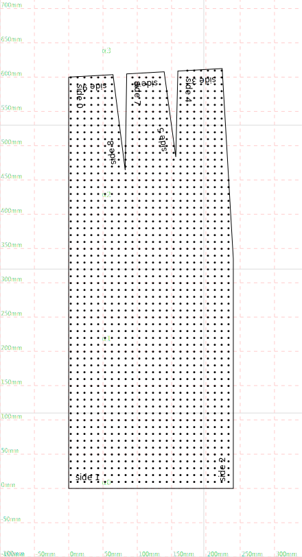
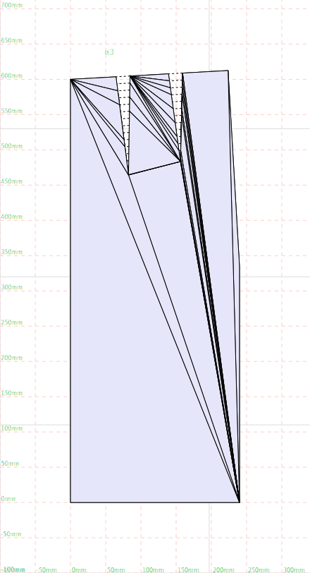
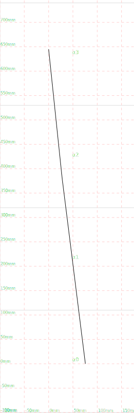
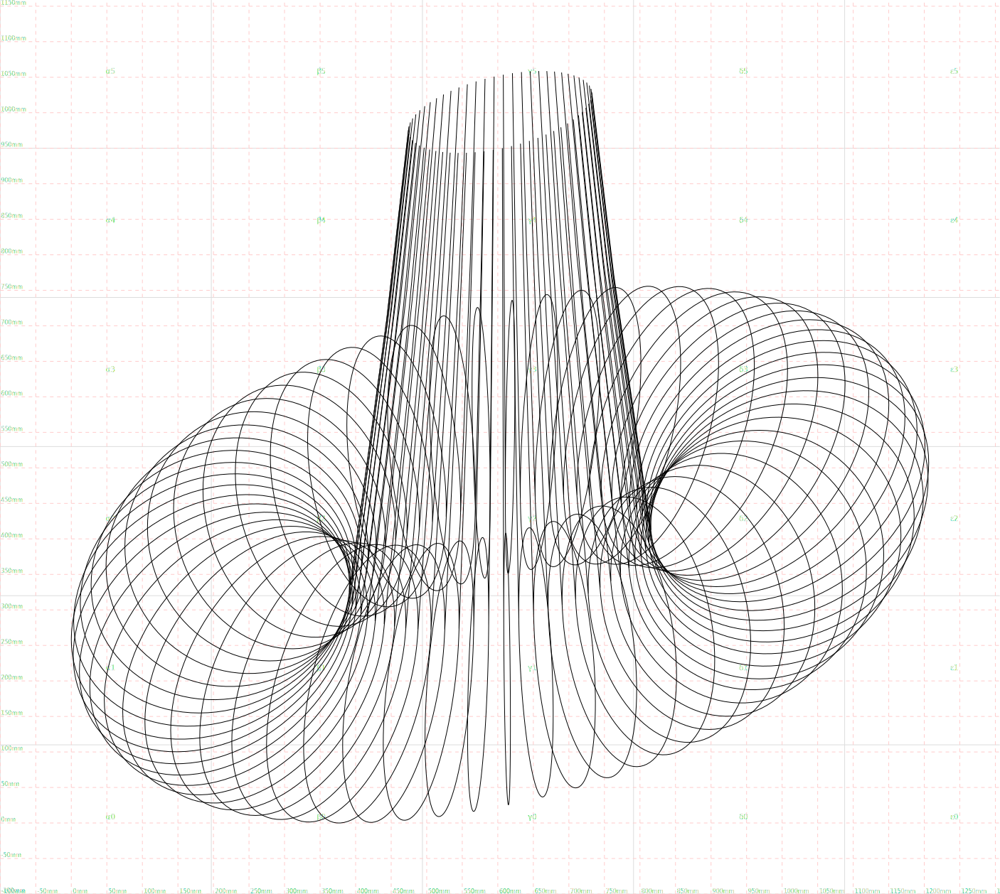

This is a python library for pattern cutting.

## `Vector` class

A class for 2d cartesian coordinates. Its used for point coordinates and
also for 2d vectors


```python
from src.geometry.Vector import Vector

origin = Vector(0,0)
origin.label = "Origin"

```

You can use the render function to generate an SVG representation of the
geometry


```python
from src.render import render
render(origin)
```


    

    


## Shape

A `Shape` object is defined by multiple points which are joined by line
segemnts to create a complicated line or shape.


```python
from src.geometry.Shape import Shape

square = Shape([
  Vector(0, 0),
  Vector(100, 0),
  Vector(100, 100),
  Vector(0, 100),
  Vector(0, 0)]
).with_label("a square").with_style("polygon")

render(square)
```


    

    


Using the `style` property, a polyline can be rendered as many different
kinds of shapes.


```python
from layout import topToBottom

shape = Shape([Vector(0, 0), Vector(100, 50), Vector(200, -50), Vector(300, 0)])

render(
  *topToBottom(
    shape.with_style("line").with_label("line"),
    shape.with_style("dashed").with_label("dashed"),
    shape.with_style("arrow").with_label("arrow"),
    shape.with_style("dashed_arrow").with_label("dashed_arrow"),
    shape.with_style("pointset").with_label("pointset"),
    shape.with_style("polygon").with_label("polygon"),
    shape.with_style("tape").with_label("tape"),
    shape.with_style("ruler").with_label("ruler")
  )
)
```


    

    


You can draw measurement markers along a polyline:


```python
render(
  square,
  *square.evenlySpacedMeasurements()
)
```


    

    


Or automatically detect corners:


```python
corners = square.corners()

render(
  square,
  *[corner.with_label("Here is a corner!") for corner in corners]
)
```


    

    


You can slice out a certain portion of a line:


```python
from layout import process
from src.geometry.Group import Group

P = square.at(25).point.with_label("P")
Q = square.at(175).point.with_label("Q")

render(
  *process(
    Group(
      square,
      P,
      Q,
    ),

    Group(
      square.slice(25, 175),
      P, Q
    )
  )
)
```


    

    


The circle class can be used to generate regular polygons with so many
sides they look like a circle:


```python
from src.geometry.Circle import Circle

circle = Circle(Vector(0, 0), 100)
triangle = circle.polyline(3)
hexagon = circle.polyline(6)
almostCircle = circle.polyline(50)

from layout import sideBySide
render(*sideBySide(triangle, hexagon, almostCircle))
```


    

    


We can put this together to get good approximations of measurements
along a curve:


```python
arc = circle.polyline(100).slice(0, 150)
render(
  arc,
  *arc.evenlySpacedMeasurements()
  )
```


    

    


## Bezier Curves


```python
from src.geometry.Shape import dashed
from src.geometry.bezier import BezierCurve
p0 = Vector(0,0).with_label("p0")
p1 = Vector(0, 50).with_label("p1")
p2 = Vector(50, 50).with_label("p2")
p3 = Vector(50, 100).with_label("p3")


mycurve = BezierCurve(p0, p1, p2, p3)

render(
  mycurve.demo()
  )
```


    

    


### Interpolating a `Shape` with Bezier Curves


```python
myshape = Shape([Vector(0,0), Vector(0, 200), Vector(200,250), Vector(250, 150), Vector(300 , 300)])

render(
  myshape.with_style("dashed"),
  myshape.interpolate(),
)
```


    

    


This makes a lot of points apear, so it might be a good idea to resample
the curve at lower resolution:


```python
interpolated = myshape.interpolate()
downsampled = interpolated.resample(25)
render(
  *topToBottom(
    interpolated.with_style("pointset"),
    downsampled.with_style("pointset").with_label("Re-sampled")
  )
)
```


    

    


Demonstrating different curve speeds


```python
gen = [myshape]
for i in range(0, 20):
  next = myshape.interpolate((i+1) / 4)
  gen.append(next)

render(*gen)
```


    

    


## Finding the closest point on a polyline

We can find the closest point on a polyline to any given coordinate:


```python
from src.geometry.Shape import dashed_arrow
shape = arc
X = Vector(90, 100)
Y = shape.closestPoint(X)

render(
  shape,
  X.with_label("X"),
  Y.with_label("Y"),
  dashed_arrow(X, Y)
)
```


    

    


You can use closest points in other methods too, such as `slice`


```python
shape = arc
P = Vector(90, 100).with_label("P")
Q = Vector(100, 0).with_label("Q")
sliced = shape.slice(P, Q)
render(
  *process(
    Group(
      P,
      Q,
      dashed_arrow(P, shape.at(P).point),
      shape.with_label("Original"),
    ),
    Group(
      sliced.with_label("sliced"),
      *sliced.points, P, Q
    )
  )
  )
```


    

    


## Replacing a section of a shape

Here are two shapes


```python
a = Shape([Vector(-100, 200), Vector(200, -100)])
b = arc

render(a.with_label("a simple shape"), b.with_label("replacement"))
```


    

    


We can replace a region of one with the other


```python
render(a.replace(b))
```


    

    


## Tweening between shapes

Tweening lets you morph one shape smoothly into another:


```python
from src.geometry.tween import tween, tween_demo

a = Shape([Vector(-100, 200), Vector(200, -100)])
b = arc

render(tween_demo(a, b))
```


    

    


A circle becoming a square,


```python
render(tween_demo(square, circle.polyline(100)))
```


    

    


## Turtle/Spirograph curves


```python
import math
from src.spirograph import spiro
angle_over_length = lambda x : math.radians(x*.1)
spiral = spiro(angle_over_length, 10000)
render(spiral)
```


    

    


## Adding darts


```python
shape = Shape([Vector(0,0), Vector(100, 0)])
shape.addDart(Vector(50, 0), 50, 20)
render(shape)
```


    

    


```python
shape = Shape([Vector(0,0), Vector(0, 100)])
shape.addDart(Vector(0, 50), 50, 20)
render(shape)
```


    

    


## Collision detection

Collision detection is powered by the
[qwertyquerty/collision](https://github.com/qwertyquerty/collision/blob/master/examples/concaves.py)
library.


```python
from src.geometry.Shape import rectangle
example_shape = rectangle(0, 0, 100, 100)
example_points = [Vector(50, 50), Vector(150, 50)]

for p in example_points:
  if example_shape.point_is_inside(p):
    p.label = "Collision!"
  else:
    p.label = "No collision!"

render(example_shape, *example_points)
```


    

    


Lets try something a bit trickier:


```python
from aldrich.tailored_skirt_block import tailored_skirt_block
from src.point_grid import point_grid_over_shape

example_shape = tailored_skirt_block()["back"]

points = []
for point in point_grid_over_shape(example_shape, margin=17):
  if example_shape.point_is_inside(point):
    points.append(point)

render(example_shape, *points)
  
```


    

    


## Triangulation

Turning a polygon into triangles:


```python
render(example_shape.triangles_renderable())

```


    

    


## Die Lemma dress block

One of the main applications of this library is to create outfits for
East London drag queen [Die
Lemma](https://www.instagram.com/die.lemma/).

A dress block for Die was created and digitised into this library:


```python
from DieLemmaDressBlock import DieLemmaDressBlock

render(DieLemmaDressBlock)
```


    

    


Drawing parallels to a complex polyline:


```python
render(
  DieLemmaDressBlock,
  DieLemmaDressBlock.parallel(50),
  *[dashed_arrow(P, Q) for P,Q in zip(DieLemmaDressBlock.points, DieLemmaDressBlock.parallel(50).points)],
  *DieLemmaDressBlock.points
)
```


    

    


or drawing inside the shape instead of outside,


```python
render(
  DieLemmaDressBlock,
  DieLemmaDressBlock.parallel(-25),
  *[dashed_arrow(P, Q) for P,Q in zip(DieLemmaDressBlock.points, DieLemmaDressBlock.parallel(-25).points)],
  *DieLemmaDressBlock.points
)
```


    

    


## Winnifred Aldrich pattern blocks

One application of this library is quickly producing pattern blocks from
Winnfred Aldrich’s book. To do that, we have to be able to use describe
body measurements:


```python
from src.sizing.BodyMeasurements import example_body_measurements
print(example_body_measurements)
```

    Size 24.74583333333333:
    	waist	= 725.0mm	(-297.4mm)
    	hips	= 900.0mm	(-338.6mm)
    	waist_to_hip	= 265.0mm	(+39.9mm)
    	body_rise	= 340.0mm	(+8.3mm)
    	bust	= 1182.4mm
    	low_waist	= 1122.4mm
    	back_width	= 417.2mm
    	chest	= 414.7mm
    	shoulder	= 140.1mm
    	neck_size	= 443.2mm
    	dart	= 108.2mm
    	top_arm	= 379.5mm
    	wrist	= 196.6mm
    	ankle	= 276.6mm
    	high_ankle	= 246.6mm
    	nape_to_waist	= 435.5mm
    	front_shoulder_to_waist	= 462.4mm
    	armscye_depth	= 240.2mm
    	waist_to_knee	= 616.9mm
    	waist_to_floor	= 1103.7mm
    	sleeve_length	= 608.4mm
    	sleeve_length_jersey	= 568.4mm
    	cuff_size_shirts	= 241.9mm
    	cuff_size_two_piece_sleeve	= 153.4mm
    	trouser_bottom_width	= 251.9mm
    	jeans_bottom_width	= 210.0mm


### Trouser block


```python
from TheClassicTailoredTrouserBlock import TheClassicTailoredTrouserBlock

render(TheClassicTailoredTrouserBlock())
```


    

    


### Skirt block


```python
from aldrich.tailored_skirt_block import tailored_skirt_block

render(tailored_skirt_block())
```


    

    


Here it is with the seam and hems marked,


```python
from aldrich.tailored_skirt_block import tailored_skirt_pattern

render(tailored_skirt_pattern())
```

    Warning: creating french seam on two lines with different length: 612.9753811041546 and 613.3124368403252


    

    


I’m planning a long flared skirt.


```python
render(tailored_skirt_pattern(skirt_length=940, flare=1.4))
```

    Warning: creating french seam on two lines with different length: 958.9489488731247 and 959.2860046092952
    Warning: creating french seam on two lines with different length: 958.9489488731247 and 959.2860046092952


    

    


## Working in 3D

Turn a 2d shape into 3d one (and back again to render it):


```python
import numpy as np
square3d = square.to_3D()

render(
  *[
    square3d.rotate(pitch=angle).isometric() for angle in np.arange(0, 6.28, 0.3)
    ]
)
```


    

    


Tweening radially,


```python
shape_1 = Shape([Vector(0,0), Vector(50, -100)])
shape_2 = Shape([Vector(0,0), Vector(50, -15), Vector(50, -200)])

render(*[
  tween(shape_1, shape_2, phase).to_3D().rotate(pitch=phase * 3.14).isometric() for phase in np.arange(0, 1, .05)
])
```


    

    


## Making a skirt for myself

I would like a skirt. To get one, I’ve measured my body a little bit:


```python
joelle_waist = 725
joelle_hips = 900
joelle_waist_to_hips = 265
```

I’ve also decided a few dimensions of the skirt I’d like to make:


```python
skirt_length_below_the_hips = 380
skirt_bottom_circumference = 1200
```

Here is a graph plotting the circumference of the skirt over height:


```python
from src.geometry.Shape import measurement_from_y_axis
skirt_circumference_graph = Shape()

origin = Vector(0,0)
waist_point = Vector(joelle_waist, 0)
hips_point = Vector(joelle_hips, -joelle_waist_to_hips)
hem_point = Vector(skirt_bottom_circumference, -joelle_waist_to_hips - skirt_length_below_the_hips)

skirt_circumference_graph.lineTo(waist_point)
skirt_circumference_graph.lineTo(hips_point)
skirt_circumference_graph.lineTo(hem_point)

render(
  skirt_circumference_graph.close_against_y_axis(),
  origin,
  measurement_from_y_axis(waist_point),
  measurement_from_y_axis(hips_point),
  measurement_from_y_axis(hem_point)
  )

```


    

    


This is the circumference of the skirt over elevation. But I think what
I need (in order to get the scrolled hem I’m looking for) is the radius.
To keep it simple I’ll imagine the skirt as a circlular prism with
radius varying across its length.


```python
skirt_radius_graph = Shape([Vector(p.x / (2*math.pi),  p.y) for p in skirt_circumference_graph.points])
render(skirt_radius_graph)
```


    

    


This is a reasonable approximation for the silhouette of the skirt.

Now I’ll add the scroll


```python
skirt_radius_graph.continue_with_arc(175, 2*math.pi)
render(skirt_radius_graph)
```


    

    


Here’s what it should look like in 3d:


```python
render(*[
  skirt_radius_graph.to_3D().rotate(pitch=angle).isometric() for angle in np.arange(0, math.pi*2, .1)
])
```


    

    


Now I’ve found a silhouette I like, I’ll unwrap this by length onto the
y-axis.


```python
final_radius_graph = Shape()
for w in np.arange(0, skirt_radius_graph.length, 10):
  x = skirt_radius_graph.pointAlong(w).x
  p = Vector(x, -w)
  final_radius_graph.lineTo(p)
render(final_radius_graph.close_against_y_axis())
```


    

    


Next we transform this back into a circumference graph


```python
final_circumference_graph = Shape(
  [Vector(x = p.x * 2*math.pi, y=p.y) for p in final_radius_graph.points]
)

render(final_circumference_graph.close_against_y_axis())
```


    

    


Wow mad. Finally, lets subdivide this into 10 pattern pieces:


```python
pattern_shape = final_circumference_graph.close_against_y_axis().subdivide_by_width(10)
render(pattern_shape)
```


    

    


Now I just need to add some seam & hem allowances. While I’m at it, I’ll
make a pattern for the boning channel.


```python
from src.geometry.Shape import rectangle

pattern_piece = Group(
  shape=pattern_shape,
  right_side = pattern_shape.sides()[0].with_style("line"),
  left_side = pattern_shape.sides()[2].with_style("line").reverse(),
  right_allowance = pattern_shape.sides()[0].allowance(-20),
  left_allowance = pattern_shape.sides()[2].allowance(-20),
  center_line = pattern_shape.vertical_center_line(),
)

boning = rectangle(pattern_shape.x_center() - 6, pattern_shape.bottom, 12, pattern_shape.height).with_label("12mm boning channel")

render(
  *sideBySide(
    pattern_piece,
    Group(
      boning,
      boning.allowance(-12)
    )
  )
)
```


    

    


Here is a demo of the construction in 3D:


```python
pattern_piece_3d = pattern_piece.to_3D()
pieces = []
for phase in np.arange(0, 1, 1.0/10.0):
  pieces.append(pattern_piece_3d.translate(z=1000).rotate(pitch=phase * 2 * math.pi).isometric())

from src.geometry.seam_lines import seam_lines

all = []
for i in range(len(pieces)):
  a = pieces[i]
  b = pieces[(i+1)%len(pieces)]
  all.append(a)
  all.append(seam_lines(a["left_side"], b["right_side"]))

render(*all)
```


    

    


